# Collaborative Resume Assistant - Pivot PRD

**Version:** 2.0 | **Date:** 2025-11-02 | **Status:** Strategic Pivot | **Owner:** Product & Growth Lead

---

## Critical Insight: The Trust Problem

### What We Learned From Real Users

A senior recruiter tested our AI resume evaluation tool. Her feedback revealed a **fundamental product positioning error:**

**BEFORE feedback capability:**
- Skeptical of AI rankings, even when accurate
- One AI mismatch destroyed all credibility
- Saw tool as "AI trying to replace me"
- Would not adopt the product

**AFTER adding feedback/re-ranking:**
- Attitude completely transformed
- Ability to provide feedback made her appreciate the tool
- Went from skeptical to engaged
- Tool became "collaborative assistant" instead of threat

**User's Conclusion:**
> "I need to rethink the product from the beginning. If I don't get it right in the first impression, it's hard to come back again."

---

## New Elevator Pitch

**Collaborative Resume Assistant** is the only AI recruiting tool that learns from your judgment. Upload 10-50 resumes, review AI rankings, provide feedback on why you agree or disagree, and watch the AI instantly re-rank based on YOUR criteria. Human expertise + AI speed = better hires in half the time.

**Tagline:** "Teach the AI what great looks like for your team."

---

## Repositioned Problem Statement

### The REAL Problem (Not What We Thought)

**Old hypothesis:** Recruiters need AI to screen resumes faster.
**Reality:** Recruiters need AI that respects their expertise and adapts to their judgment.

**Why AI resume tools fail:**
1. **Trust deficit:** Recruiters don't trust black-box AI decisions
2. **Loss of control:** AI makes final decision without recruiter input
3. **One-size-fits-all:** AI doesn't understand unique team culture, unspoken requirements
4. **No learning:** AI never improves from recruiter corrections
5. **Credibility fragile:** One mismatch between AI and human = complete rejection

**What recruiters ACTUALLY want:**
- To be IN CONTROL of final rankings
- AI to surface insights they might miss
- Ability to teach AI what matters for their specific role/team
- Transparent reasoning they can critique and correct
- Tool that gets smarter the more they use it

---

## Revised Target User

### Primary: Senior Recruiter Who's Skeptical of AI

**Demographics:**
- 5+ years recruiting experience
- Reviews 20-50 resumes per role
- Works in-house at 50-500 person company
- Has "gut feel" for good candidates (wants to preserve this)

**Psychographics:**
- Skeptical of AI replacing human judgment
- Burned by ATS keyword filters missing great candidates
- Wants tools that make them better, not replaceable
- Values speed but not at cost of quality
- Has opinions on what makes a good candidate (wants to share them)

**Pain Points:**
- Resume screening takes 3-4 hours per role
- Hard to explain why she likes/dislikes candidates
- Inconsistent evaluations across time
- AI tools make decisions she disagrees with
- No way to correct AI mistakes

**Jobs to Be Done:**
1. Screen 40 resumes in <1 hour (speed)
2. Document WHY I like certain candidates (justification)
3. Teach AI to match MY judgment over time (learning)
4. Override AI when I know better (control)
5. Show hiring managers I'm data-driven (credibility)

---

## Core Value Proposition (REVISED)

**For senior recruiters** who review 20-50 resumes per role,
**Collaborative Resume Assistant** is an AI-powered ranking tool
**that** learns from YOUR feedback and re-ranks candidates based on your expertise,
**unlike** black-box AI screening tools that ignore recruiter judgment,
**our solution** puts you in control while giving you AI speed, creating rankings that get smarter every time you use them.

### Key Differentiators (NEW)

1. **Feedback Loop is the Product** - Not optional, it's the core workflow
2. **Instant Re-Ranking** - See how your feedback changes results (<15 seconds)
3. **Sentiment + Reason Codes** - Quick feedback (thumbs up/down + tags)
4. **Comparison Views** - Toggle between AI ranking vs. Your ranking vs. Blended
5. **Learning Over Time** - AI adapts to your preferences across evaluations
6. **Audit Trail** - Every override documented with your reasoning

---

## P0 Features for Collaborative MVP

### 1. Inline Candidate Feedback (CRITICAL - NEW)

**What:** Feedback controls on every candidate card in results view

**UI Components:**
- Sentiment: 👍 Agree / 👎 Disagree / ➡️ Neutral
- Quick reason codes:
  - "Better culture fit than AI thinks"
  - "Missing critical soft skill"
  - "Experience more relevant than score shows"
  - "Red flag AI didn't catch"
  - Custom note (free text)
- Visual indicator: Shows MY rating vs. AI rating

**Acceptance Criteria:**
- Add feedback in <5 seconds per candidate
- Feedback persists to database (candidate_rankings table)
- Can edit feedback later
- Feedback badge shows on candidate card ("You: 👍 Better fit")

**Effort:** 2-3 days
**Database:** Leverage existing `candidate_rankings` table, add `sentiment`, `reason_codes`, `feedback_notes` columns

---

### 2. Re-Ranking Algorithm (CRITICAL - NEW)

**What:** When user provides feedback, re-run AI evaluation with user preferences as input

**How It Works:**
1. User provides feedback on 3-5 candidates
2. Click "Re-rank with My Feedback" button
3. API sends original job description + resume + user feedback to Claude
4. Prompt includes: "Previous AI ranked this 78/100, but recruiter says: [feedback]"
5. Claude re-evaluates with context, adjusts scores
6. New ranking returned in <15 seconds

**Prompt Engineering:**
```
You previously evaluated this candidate and gave them 78/100.
However, the recruiter provided this feedback:
- Sentiment: Disagree (too low)
- Reason: "Experience more relevant than score shows -
  led similar team at smaller company"

Re-evaluate this candidate considering the recruiter's expertise.
Adjust your scoring to account for factors the recruiter values.
```

**Acceptance Criteria:**
- Re-ranking completes in <15 seconds for up to 10 candidates
- New scores differ from original by at least 5-10 points where feedback provided
- Reasoning explains how feedback influenced score
- Cost: $0.002 per re-evaluation (cheaper than initial)

**Effort:** 3-4 days (prompt engineering, API endpoint, testing)

---

### 3. Comparison View Toggle (CRITICAL - NEW)

**What:** Side-by-side comparison of AI ranking vs. My ranking vs. Blended

**UI:**
```
┌─────────────────────────────────────────┐
│ View: [AI Ranking] [My Ranking] [Blended] │
├─────────────────────────────────────────┤
│ AI Ranking:                             │
│ 1. Jane Smith (87) - No feedback        │
│ 2. John Doe (76) - 👎 You: Too high     │
│ 3. Mike Wilson (64) - 👍 You: Underrated│
│                                         │
│ My Ranking (after feedback):            │
│ 1. Jane Smith (87) - Same               │
│ 2. Mike Wilson (72) ↑ +8 points         │
│ 3. John Doe (68) ↓ -8 points            │
│                                         │
│ Blended (50% AI + 50% You):             │
│ 1. Jane Smith (87)                      │
│ 2. Mike Wilson (68)                     │
│ 3. John Doe (72)                        │
└─────────────────────────────────────────┘
```

**Acceptance Criteria:**
- Toggle switches view instantly (<500ms)
- Shows movement arrows (↑↓) for rank changes
- Highlights candidates with feedback
- Export works for any view

**Effort:** 2 days (frontend state management)

---

### 4. Feedback-Driven Shortlist (NEW)

**What:** Quick action to mark candidates for interview based on MY ranking, not AI

**UI:**
- "Create Shortlist from My Ranking" button
- Selects top N candidates from MY ranking (not AI)
- Shows side-by-side: "AI would interview X, Y, Z" vs. "You selected A, B, C"
- Comparison highlights: 2 overlap, 1 different

**Why This Matters:**
- Proves the tool respects human judgment
- Shows value of feedback loop
- Creates "aha moment" when human+AI beats either alone

**Acceptance Criteria:**
- One-click shortlist creation
- Shows comparison (AI vs. You)
- Export shortlist with feedback notes

**Effort:** 1-2 days

---

### 5. Simplified Feedback UI (First Impression - NEW)

**What:** On first evaluation, show lightweight feedback prompt immediately

**Flow:**
1. AI evaluation completes
2. Modal appears: "Quick question: Do these rankings match your gut feel?"
3. User can:
   - 👍 "Looks good" → Skip to export
   - 👎 "Not quite" → Show feedback interface
   - ⚙️ "Let me review first" → Dismiss modal
4. If user provides ANY feedback → Toast: "Want to see re-ranking? It takes 10 seconds"
5. One-click re-rank from toast

**Why Critical:**
- First 30 seconds determine trust
- Must show feedback capability IMMEDIATELY
- Can't bury feedback in settings/advanced features

**Acceptance Criteria:**
- Modal appears within 2 seconds of results loading
- Dismissible (not blocking)
- Feedback interface appears inline, not separate page

**Effort:** 1 day (simple modal)

---

## P1 Features (Post-Launch, Week 2-3)

### 6. Reason Code Library (Learning from Patterns)

**What:** Track most common feedback reasons, suggest them

**Example:**
- User gives feedback: "Culture fit better than AI thinks" 3 times
- System suggests this as quick-select option on future candidates
- Builds personalized reason code library per user

**Effort:** 2 days

---

### 7. Feedback Analytics Dashboard

**What:** Show user how their feedback improves accuracy over time

**Metrics:**
- Feedback given: 12 candidates across 3 jobs
- Avg AI vs. You agreement: 75% → 85% (improving!)
- Top reason codes: Culture fit (5), Soft skills (3)
- Re-ranking impact: Moved 4 candidates to shortlist AI would've missed

**Why:** Gamification + proof of value

**Effort:** 3 days

---

### 8. Bulk Feedback Actions

**What:** Select 3-5 candidates, apply same feedback

**Example:**
- Select Mike, Sarah, Tom
- "All underrated: More industry experience than AI knows"
- Apply to all, re-rank batch

**Effort:** 2 days

---

### 9. Interview Guide with Feedback Context (Enhanced)

**What:** Generate interview questions that probe areas of disagreement

**Example:**
- AI scored culture fit 7/10
- You said "Better culture fit than AI thinks"
- Interview guide includes: "Tell me about how you build team culture" (to validate your intuition)

**Effort:** 2 days (prompt modification)

---

## P2 Features (Future / Post-MVP)

10. **Team Feedback Aggregation** - Multiple recruiters provide feedback, AI learns from team consensus
11. **Feedback Templates** - Save feedback patterns as reusable templates
12. **Versioning / Audit Trail** - See how rankings evolved over time with feedback
13. **Confidence Scores** - AI shows confidence (low confidence = ask for feedback)
14. **Export with Feedback** - PDF shows "AI ranked X, recruiter adjusted to Y because..."

---

## Explicitly OUT OF SCOPE for Collaborative MVP

1. ❌ **Automatic learning across jobs** - Manual feedback only, no auto-tuning (privacy + complexity)
2. ❌ **AI explaining recruiter reasoning** - Tool captures feedback, doesn't generate it
3. ❌ **Real-time collaboration** - Single user only, no live co-ranking
4. ❌ **Feedback on interview guides** - Stage 1 only, not Stage 2 yet
5. ❌ **Advanced ML models** - Use Claude prompt engineering, not custom ML
6. ❌ **A/B testing recruiter preferences** - No experimentation features yet
7. ❌ **Integration with ATS** - Standalone tool, manual export to ATS

---

## Success Metrics (REVISED)

### One Metric That Matters: Feedback Engagement Rate

**Definition:** % of users who provide feedback on at least 1 candidate within first session

**Target:** 80% (up from previous activation metric)

**Why This Metric:**
- Proves users trust the feedback loop
- Leading indicator of retention (engaged users return)
- Validates product positioning (collaborative vs. automated)

### Supporting KPIs

#### Feedback Quality
- **Feedback given per evaluation:** Target: 3-5 candidates per batch
- **Re-ranking triggered:** Target: 60% of evaluations (users act on feedback)
- **Feedback satisfaction:** "Did re-ranking improve results?" → 4.5/5.0

#### Trust Indicators
- **AI vs. Human ranking correlation:** Track over time (should increase)
- **Override rate:** % of candidates moved by >10 points via feedback (expect 20-30%)
- **Shortlist differences:** Avg 1-2 candidates different between AI and human shortlist

#### Product Adoption
- **D7 retention:** 50% (up from 40%, feedback drives retention)
- **Feature usage:** 70% of users try re-ranking within first 3 evaluations
- **Time to value:** <5 minutes (from upload to feedback to re-rank)

#### Business
- **Free → Paid conversion:** 20% (up from 15%, feedback is premium feature)
- **ARPU:** $35/month (up from $25, collaborative features command premium)
- **NPS:** 50+ (up from unknown, trust drives advocacy)

---

## User Flows (Collaborative Focus)

### Flow 1: First-Time User - Feedback Discovery


**Key Insight:** Feedback is discovered organically, not hidden in settings.

---

### Flow 2: Returning User - Efficient Collaboration

```mermaid
flowchart TD
    A[Login → Dashboard] --> B[Select job or create new]
    B --> C[Upload 20 resumes]
    C --> D[AI ranking complete]
    D --> E[Quick scan: Do I agree?]
    E --> F{Any surprises?}
    F -->|No| G[Export top 5]
    F -->|Yes| H[Provide feedback on 3-4 candidates]
    H --> I[Click Re-rank with Feedback]
    I --> J[Wait 15 seconds]
    J --> K[Toggle view: AI → My Ranking]
    K --> L[Review movement: 2 moved up, 1 moved down]
    L --> M{Satisfied with new ranking?}
    M -->|Yes| N[Create shortlist from My Ranking]
    M -->|No| O[Adjust feedback, re-rank again]
    N --> P[Export with feedback notes]
    P --> Q[Share with hiring manager]
```



**Key Insight:** Feedback → Re-rank → Compare becomes muscle memory.

---

### Flow 3: Power User - Personalized AI


**Key Insight:** Long-term value = AI learns user preferences over time.

---

## Wireframes (Collaborative Features)

### Wireframe C1: Candidate Card with Feedback (NEW)

```
┌─────────────────────────────────────────────────────────────┐
│ Jane Smith                                  AI Score: 87/100 │
│ Recommendation: INTERVIEW 🟢                                 │
├─────────────────────────────────────────────────────────────┤
│ Your Feedback:                                               │
│ [ 👍 Agree ] [ 👎 Disagree ] [ ➡️ Neutral ]                  │
│                                                               │
│ ☐ Better culture fit than AI thinks                         │
│ ☐ Missing critical soft skill                               │
│ ☐ Experience more relevant than score shows                 │
│ ☐ Red flag AI didn't catch                                  │
│                                                               │
│ Add note (optional):                                         │
│ ┌───────────────────────────────────────────────────────┐   │
│ │ Led similar projects at smaller company - AI under-   │   │
│ │ valued this experience.                                │   │
│ └───────────────────────────────────────────────────────┘   │
│                                                               │
│ [ Save Feedback ]                                            │
│                                                               │
│ ▼ AI Analysis (qualifications, experience, risk flags...)   │
└─────────────────────────────────────────────────────────────┘
```

**Key Elements:**
- Inline feedback (no modal, no separate page)
- Quick sentiment buttons (5-second decision)
- Checkbox reason codes (faster than typing)
- Optional free-text note (for nuance)
- Feedback badge shows on card after save

---

### Wireframe C2: Re-Ranking Flow (NEW)

```
┌─────────────────────────────────────────────────────────────┐
│ Feedback Provided (3 candidates)            [Re-rank with My Feedback] │
├─────────────────────────────────────────────────────────────┤
│                                                               │
│ You provided feedback on:                                    │
│ • Jane Smith: 👍 Agree (87 → No change expected)            │
│ • John Doe: 👎 Disagree - Too high (76 → Lower expected)    │
│ • Mike Wilson: 👍 Underrated (64 → Higher expected)         │
│                                                               │
│ Re-ranking will:                                              │
│ 1. Send your feedback to AI                                  │
│ 2. AI re-evaluates with your context                         │
│ 3. New scores generated in ~15 seconds                       │
│                                                               │
│ Cost: $0.006 (3 candidates × $0.002)                         │
│                                                               │
│ [Cancel]                           [Confirm Re-rank →]       │
└─────────────────────────────────────────────────────────────┘

(After re-ranking completes)

┌─────────────────────────────────────────────────────────────┐
│ Re-ranking Complete! View: [AI Ranking] [My Ranking] [Blended]│
├─────────────────────────────────────────────────────────────┤
│                                                               │
│ MY RANKING (based on your feedback):                         │
│                                                               │
│ 1. Jane Smith (87) - No change - You agreed ✓                │
│ 2. Mike Wilson (72) ↑ +8 points - You: Underrated ✓         │
│ 3. John Doe (68) ↓ -8 points - You: Too high ✓              │
│                                                               │
│ Changes Summary:                                              │
│ • 2 candidates moved based on your feedback                  │
│ • Mike Wilson now in shortlist (was 3rd, now 2nd)           │
│ • John Doe moved to phone screen tier                        │
│                                                               │
│ [ Export My Ranking ] [ Create Shortlist ] [ Adjust & Re-rank Again ]│
└─────────────────────────────────────────────────────────────┘
```

**Key Elements:**
- Clear preview of what re-rank will do
- Transparent cost (<$0.01 for most)
- Before/after comparison
- Movement indicators (↑↓ with points)
- Actions: Export, shortlist, iterate

---

### Wireframe C3: Comparison View Toggle (NEW)

```
┌─────────────────────────────────────────────────────────────┐
│ View Rankings:  [● AI Ranking] [ My Ranking ] [ Blended ]   │
├─────────────────────────────────────────────────────────────┤
│                                                               │
│ Rank | Candidate      | AI Score | Your Score | Difference  │
│──────┼────────────────┼──────────┼────────────┼─────────────│
│  1   | Jane Smith     |   87     |    87      |  Same ✓     │
│  2   | John Doe       |   76     |    68      |  ↓ -8 👎    │
│  3   | Mike Wilson    |   64     |    72      |  ↑ +8 👍    │
│  4   | Sarah Lee      |   59     |    59      |  Same       │
│──────┴────────────────┴──────────┴────────────┴─────────────│
│                                                               │
│ Agreement: 50% (2 of 4 same) | Avg difference: 8 points     │
│                                                               │
│ [ Export AI Ranking ] [ Export My Ranking ] [ Export Both ]  │
└─────────────────────────────────────────────────────────────┘

(Switched to "My Ranking" view)

┌─────────────────────────────────────────────────────────────┐
│ View Rankings:  [ AI Ranking ] [● My Ranking ] [ Blended ]  │
├─────────────────────────────────────────────────────────────┤
│                                                               │
│ Rank | Candidate      | Score | Feedback                    │
│──────┼────────────────┼───────┼─────────────────────────────│
│  1   | Jane Smith     |  87   | 👍 Agree                   │
│  2   | Mike Wilson    |  72   | 👍 Underrated - Better exp │
│  3   | John Doe       |  68   | 👎 Too high - Culture fit  │
│  4   | Sarah Lee      |  59   | No feedback                │
│──────┴────────────────┴───────┴─────────────────────────────│
│                                                               │
│ [ Create Shortlist from Top 2 ] [ Generate Interview Guides ]│
└─────────────────────────────────────────────────────────────┘
```

**Key Elements:**
- Toggle switches view (no page reload)
- Side-by-side comparison table
- Feedback notes visible in My Ranking view
- Agreement % shown (gamification)
- Actions contextual to view

---

### Wireframe C4: First-Time Feedback Prompt (NEW)

```
┌───────────────────────────────────────────┐
│ AI Ranking Complete                    [×]│
├───────────────────────────────────────────┤
│                                           │
│ Quick question before you export:         │
│                                           │
│ Do these rankings match your gut feel?    │
│                                           │
│ [ 👍 Looks Good ]  [ 👎 Not Quite ]      │
│                                           │
│ Why we ask: Your feedback makes the AI    │
│ smarter for YOUR team's needs. It takes   │
│ 30 seconds and you'll see re-ranking.     │
│                                           │
│ [ ⚙️ Let Me Review First ]               │
│                                           │
└───────────────────────────────────────────┘

(If user clicks "Not Quite")

┌─────────────────────────────────────────────────────────────┐
│ Thanks! Tell us where the AI got it wrong:                  │
├─────────────────────────────────────────────────────────────┤
│                                                               │
│ (Inline feedback UI appears on candidate cards...)          │
│                                                               │
│ After you mark 2-3 candidates, we'll re-rank in 10 seconds. │
│                                                               │
└─────────────────────────────────────────────────────────────┘
```

**Key Elements:**
- Appears immediately after first evaluation
- Friendly, non-blocking tone
- Binary choice (easy decision)
- "Let me review first" gives control
- Explains value ("makes AI smarter")

---

## Technical Specification Updates

### Database Schema Changes

**Extend `candidate_rankings` table** (already exists!):

```sql
-- Migration 004: Add Feedback Columns
ALTER TABLE candidate_rankings
ADD COLUMN sentiment VARCHAR(20), -- 'agree', 'disagree', 'neutral'
ADD COLUMN reason_codes JSONB DEFAULT '[]'::jsonb, -- ['better_culture_fit', 'soft_skills']
ADD COLUMN feedback_notes TEXT,
ADD COLUMN original_ai_score INTEGER, -- Store original before feedback
ADD COLUMN adjusted_score INTEGER, -- Store score after re-ranking
ADD COLUMN feedback_timestamp TIMESTAMP WITH TIME ZONE DEFAULT NOW();

-- Index for feedback queries
CREATE INDEX idx_candidate_rankings_sentiment ON candidate_rankings(sentiment);
CREATE INDEX idx_candidate_rankings_job_feedback ON candidate_rankings(job_id)
  WHERE sentiment IS NOT NULL;

COMMENT ON COLUMN candidate_rankings.sentiment IS 'Recruiter sentiment: agree, disagree, neutral';
COMMENT ON COLUMN candidate_rankings.reason_codes IS 'Array of quick reason codes for feedback';
COMMENT ON COLUMN candidate_rankings.original_ai_score IS 'AI score before recruiter feedback';
COMMENT ON COLUMN candidate_rankings.adjusted_score IS 'Score after re-ranking with feedback';
```

**New table: `feedback_reason_library` (P1)**:

```sql
CREATE TABLE feedback_reason_library (
  id UUID PRIMARY KEY DEFAULT gen_random_uuid(),
  user_id UUID REFERENCES auth.users(id), -- Personalized per user
  reason_code VARCHAR(100),
  display_text VARCHAR(255),
  usage_count INTEGER DEFAULT 1,
  created_at TIMESTAMP WITH TIME ZONE DEFAULT NOW()
);

COMMENT ON TABLE feedback_reason_library IS 'User-specific feedback reason codes that appear frequently';
```

---

### API Endpoints (New)

#### POST /api/rerank_with_feedback

**Request:**
```json
{
  "job_id": "uuid",
  "candidates": [
    {
      "candidate_id": "uuid",
      "original_score": 76,
      "feedback": {
        "sentiment": "disagree",
        "reason_codes": ["too_high", "culture_fit_concern"],
        "notes": "Missing collaborative skills we need"
      }
    },
    {
      "candidate_id": "uuid",
      "original_score": 64,
      "feedback": {
        "sentiment": "disagree",
        "reason_codes": ["underrated", "better_experience"],
        "notes": "Startup experience more valuable than AI scored"
      }
    }
  ],
  "provider": "anthropic",
  "model": "claude-3-5-haiku-20241022"
}
```

**Response:**
```json
{
  "success": true,
  "reranked_candidates": [
    {
      "candidate_id": "uuid",
      "original_score": 64,
      "adjusted_score": 72,
      "movement": 8,
      "new_rank": 2,
      "reasoning": "Recruiter feedback highlighted startup experience leadership that initial evaluation underweighted. Adjusted experience score from 28/40 to 35/40..."
    },
    {
      "candidate_id": "uuid",
      "original_score": 76,
      "adjusted_score": 68,
      "movement": -8,
      "new_rank": 3,
      "reasoning": "Recruiter identified culture fit concern around collaboration. Reduced cultural fit subscore based on feedback..."
    }
  ],
  "usage": {
    "total_cost": 0.006,
    "candidates_reranked": 2,
    "avg_cost_per_candidate": 0.003
  }
}
```

**Implementation:**
- New `api/rerank_candidate.py` serverless function
- Modifies prompt to include user feedback context
- Calls Claude with feedback-augmented prompt
- Returns new scores + reasoning
- Saves to `candidate_rankings` table

**Effort:** 3 days (new endpoint, prompt engineering, testing)

---

#### GET /api/feedback_analytics

**Request:**
```
GET /api/feedback_analytics?user_id=uuid&job_id=uuid (optional)
```

**Response:**
```json
{
  "feedback_given": 12,
  "evaluations_with_feedback": 3,
  "rerank_triggered": 2,
  "avg_ai_vs_user_agreement": 0.75,
  "top_reason_codes": [
    {"code": "better_culture_fit", "count": 5},
    {"code": "soft_skills", "count": 3}
  ],
  "candidates_moved": {
    "up": 4,
    "down": 2,
    "no_change": 6
  }
}
```

**Effort:** 2 days (P1 feature)

---

### Frontend State Management (React Query + Zustand)

**New Zustand Store: `useFeedbackStore`**

```javascript
// frontend/src/stores/feedbackStore.js
import create from 'zustand'

export const useFeedbackStore = create((set, get) => ({
  // State
  feedbackByCandidateId: {}, // { candidate_id: { sentiment, reason_codes, notes } }
  rerankingInProgress: false,
  comparisonView: 'ai', // 'ai' | 'my' | 'blended'

  // Actions
  setFeedback: (candidateId, feedback) => set(state => ({
    feedbackByCandidateId: {
      ...state.feedbackByCandidateId,
      [candidateId]: feedback
    }
  })),

  setComparisonView: (view) => set({ comparisonView: view }),

  setRerankingInProgress: (status) => set({ rerankingInProgress: status }),

  clearFeedback: () => set({ feedbackByCandidateId: {} })
}))
```

**React Query Hook:**

```javascript
// frontend/src/hooks/useReranking.js
import { useMutation, useQueryClient } from '@tanstack/react-query'
import { apiClient } from '../services/api'

export function useReranking(jobId) {
  const queryClient = useQueryClient()

  return useMutation({
    mutationFn: (feedbackData) => apiClient.rerankWithFeedback(jobId, feedbackData),
    onSuccess: (data) => {
      // Invalidate candidates query to refetch with new scores
      queryClient.invalidateQueries(['candidates', jobId])
      queryClient.invalidateQueries(['rankings', jobId])
    }
  })
}
```

**Effort:** 2 days (state management + integration)

---

### Prompt Engineering (Critical)

**Stage 1 Evaluation Prompt (Modified):**

```python
def build_stage1_with_feedback_prompt(skill_instructions, job_data, candidate_data, feedback=None):
    """Build Stage 1 prompt with optional recruiter feedback context"""

    base_prompt = build_stage1_prompt(skill_instructions, job_data, candidate_data)

    if not feedback:
        return base_prompt

    # Add feedback context
    feedback_context = f"""
---

IMPORTANT RECRUITER FEEDBACK:

A senior recruiter previously reviewed this candidate and provided feedback:

- Sentiment: {feedback['sentiment']} (the AI scoring)
- Reason Codes: {', '.join(feedback['reason_codes'])}
- Notes: {feedback['notes']}

INSTRUCTIONS:
1. Consider the recruiter's expertise and local context
2. Re-evaluate areas where feedback highlights gaps in initial assessment
3. Adjust scoring to account for factors the recruiter values
4. Explain how feedback influenced your new evaluation
5. If feedback reveals new information, update scores accordingly

The recruiter has direct knowledge of team culture, unspoken requirements,
and candidate nuances that may not appear in the resume text alone.
Give significant weight to their judgment.

---
"""

    return base_prompt + feedback_context
```

**Example Re-ranking Prompt:**

```
TASK: Re-evaluate this candidate considering recruiter feedback.

ORIGINAL AI EVALUATION:
- Score: 76/100
- Recommendation: PHONE SCREEN FIRST
- Qualifications: 32/40
- Experience: 30/40
- Risk Flags: 14/20

RECRUITER FEEDBACK:
- Sentiment: Disagree (score too low)
- Reason: "Experience more relevant than AI scored - led similar projects
  at smaller company where impact was higher"
- Notes: "Startup experience should count for more given our stage"

RE-EVALUATION INSTRUCTIONS:
1. Review experience section with recruiter's context
2. Consider: Is startup experience more valuable than large company experience
   for this role?
3. Did initial evaluation underweight leadership in ambiguous environments?
4. Adjust experience score if recruiter identified relevant factors
5. Explain changes in reasoning section

Provide updated evaluation in same format as original.
```

**Effort:** 2 days (prompt iteration + testing)

---

## Weekly Ship Plan (4 Weeks to Collaborative MVP)

### Week 1: Core Feedback Infrastructure

**Goal:** Lay foundation for feedback capture and storage

**Tasks:**
- [ ] Migration 004: Extend `candidate_rankings` table with feedback columns
- [ ] Frontend: `useFeedbackStore` Zustand store
- [ ] Frontend: Inline feedback UI component (Wireframe C1)
- [ ] API: Save feedback endpoint (updates `candidate_rankings`)
- [ ] Test: Feedback persists to database

**Acceptance:**
- User can add feedback to candidate
- Feedback saves to DB
- Feedback displays on candidate card

**Effort:** 5 days

---

### Week 2: Re-Ranking Algorithm + Comparison View

**Goal:** Make feedback actionable with re-ranking

**Tasks:**
- [ ] API: `/api/rerank_with_feedback` endpoint
- [ ] Prompt engineering: Feedback-augmented evaluation prompts
- [ ] Frontend: Re-rank button + loading state
- [ ] Frontend: Comparison view toggle (Wireframe C3)
- [ ] Frontend: Movement indicators (↑↓ with points)
- [ ] Test: Re-ranking completes <15 seconds

**Acceptance:**
- User provides feedback → clicks re-rank → sees new scores
- Comparison view shows AI vs. My Ranking
- Movement arrows show rank changes

**Effort:** 5 days

---

### Week 3: First-Time UX + Shortlist

**Goal:** Optimize first impression and core workflow

**Tasks:**
- [ ] Frontend: First-time feedback prompt modal (Wireframe C4)
- [ ] Frontend: Feedback-driven shortlist feature
- [ ] Frontend: Export with feedback notes (PDF)
- [ ] Polish: Loading states, error handling
- [ ] Test: End-to-end feedback → re-rank → export flow

**Acceptance:**
- New user sees feedback prompt after first evaluation
- Can create shortlist from "My Ranking"
- Export PDF includes feedback notes

**Effort:** 5 days

---

### Week 4: Analytics + Launch Prep

**Goal:** Prove value with metrics, prepare for launch

**Tasks:**
- [ ] API: `/api/feedback_analytics` endpoint (P1)
- [ ] Frontend: Feedback analytics widget on dashboard
- [ ] Event tracking: Feedback given, re-rank triggered, agreement %
- [ ] Docs: Update help content for feedback features
- [ ] Polish: Visual refinements, mobile responsiveness
- [ ] Beta test: 3 recruiters test feedback flow, collect feedback
- [ ] Launch prep: Update landing page, pricing (feedback = premium feature)

**Acceptance:**
- Analytics show feedback engagement rate
- All P0 features tested and working
- Ready for limited beta launch

**Effort:** 5 days

---

**Total:** 4 weeks to Collaborative MVP (20 days engineering)

---

## Scope Analysis: MVP vs. Post-Launch

| Feature | P0 (MVP) | P1 (Post-Launch) | P2 (Future) | Effort (Days) | Rationale |
|---------|----------|------------------|-------------|---------------|-----------|
| **Inline candidate feedback** | ✅ | - | - | 2 | Core differentiator, must ship Week 1 |
| **Re-ranking algorithm** | ✅ | - | - | 3 | Trust mechanism, can't defer |
| **Comparison view toggle** | ✅ | - | - | 2 | Shows value of feedback visually |
| **Feedback-driven shortlist** | ✅ | - | - | 1 | "Aha moment" feature |
| **First-time feedback prompt** | ✅ | - | - | 1 | Critical for first impression |
| **Reason code library** | - | ✅ | - | 2 | Nice-to-have, improves speed |
| **Feedback analytics dashboard** | - | ✅ | - | 3 | Proves value over time |
| **Bulk feedback actions** | - | ✅ | - | 2 | Power user feature |
| **Interview guide with feedback** | - | ✅ | - | 2 | Enhances existing feature |
| **Team feedback aggregation** | - | - | ✅ | 5 | Multi-user complexity |
| **Feedback templates** | - | - | ✅ | 3 | Marginal value vs. effort |
| **Versioning / audit trail** | - | - | ✅ | 4 | Compliance feature (enterprise) |
| **Confidence scores** | - | - | ✅ | 3 | Interesting but not critical |
| **Export with feedback context** | ✅ | - | - | 1 | Shows AI+human collaboration |
| **Batch upload** | ✅ | - | - | 0 | Already built |
| **PDF parsing** | ✅ | - | - | 0 | Already built |
| **Stage 1 AI evaluation** | ✅ | - | - | 0 | Already built |
| **Multi-LLM support** | ✅ | - | - | 0 | Already built |
| **Supabase auth + storage** | ✅ | - | - | 0 | Already built (partial) |
| **Anonymous user flow** | - | ✅ | - | 2 | Growth hack, defer for MVP focus |
| **Stage 2 evaluation** | - | ✅ | - | 5 | Post-interview, can wait |
| **Interview guide generation** | - | ✅ | - | 3 | Valuable but not core to pivot |

**MVP Total:** 10 features, ~10 days net new (20 days including refinement)
**Reuse:** 80% of backend (Python API, Claude, Supabase schema)

---

## Event Tracking Plan

| Event Name | Trigger | Properties | Why It Matters |
|------------|---------|------------|----------------|
| `feedback_given` | User saves feedback on candidate | `candidate_id`, `sentiment`, `reason_codes_count`, `has_notes`, `session_id` | Core engagement metric |
| `rerank_triggered` | User clicks "Re-rank with Feedback" | `job_id`, `candidates_count`, `cost`, `session_id` | Conversion to paid action |
| `rerank_completed` | Re-ranking API returns | `job_id`, `candidates_reranked`, `avg_movement_points`, `duration_ms` | Performance + impact tracking |
| `comparison_view_toggled` | User switches AI/My/Blended view | `from_view`, `to_view`, `job_id` | Feature adoption |
| `shortlist_created_from_my_ranking` | User creates shortlist from My Ranking | `job_id`, `shortlist_count`, `diff_from_ai_count` | Outcome metric (trust AI+human) |
| `feedback_prompt_shown` | First-time modal appears | `session_id`, `evaluation_id` | Top-of-funnel for feedback |
| `feedback_prompt_dismissed` | User clicks "Let me review first" | `session_id`, `evaluation_id` | Friction point |
| `feedback_prompt_engaged` | User clicks "Not quite" | `session_id`, `evaluation_id` | Activation signal |
| `ai_vs_human_agreement_calculated` | System calculates after re-rank | `job_id`, `agreement_pct`, `avg_point_diff` | Trust indicator |
| `export_with_feedback` | User exports PDF with feedback | `job_id`, `candidates_with_feedback_count`, `format` | Outcome (sharing results) |
| `feedback_analytics_viewed` | User visits analytics dashboard | `user_id`, `jobs_with_feedback_count` | Engagement with proof of value |

**Implementation:** PostHog or Mixpanel
**Effort:** 1 day (Week 4)

---

## Risks & Mitigations (Updated)

| Risk | Impact | Probability | Mitigation |
|------|--------|-------------|------------|
| **Users don't provide feedback** | Critical | Medium | First-time modal, inline UI (not buried), show value immediately |
| **Re-ranking too slow (>15s)** | High | Low | Use Claude Haiku (fast), optimize prompt, cache job context |
| **Re-ranking doesn't change scores enough** | High | Medium | Prompt engineering: Weight feedback heavily, A/B test prompts |
| **Users give contradictory feedback** | Medium | High | Allow editing, show "Your feedback history" for consistency |
| **Feedback adds too much friction** | Medium | Medium | Quick sentiment buttons, reason codes (not just free text) |
| **Cost of re-ranking too high** | Medium | Low | $0.002/candidate (5x cheaper than initial), only re-rank with feedback |
| **Users expect AI to learn automatically** | Medium | High | Messaging: "Your feedback improves THIS job's ranking" (not global) |
| **Comparison view confuses users** | Medium | Medium | User testing, tooltips, default to "My Ranking" after re-rank |
| **Database schema change breaks existing data** | High | Low | Migration 004 adds columns (non-breaking), test on staging first |

---

## Launch Criteria (Collaborative MVP)

### Functional Completeness
- ✅ All P0 feedback features implemented (5 features)
- ✅ Re-ranking completes <15 seconds (tested with 10 candidates)
- ✅ Feedback persists to database and survives refresh
- ✅ Comparison view shows accurate rank changes
- ✅ Export includes feedback notes

### Quality Gates
- ✅ Zero P0 bugs (feedback loop must work perfectly)
- ✅ Re-ranking accuracy: 80% of feedback moves candidates 5+ points
- ✅ Performance: Re-rank 10 candidates <15 seconds (P95)
- ✅ Mobile: Feedback UI works on tablet/phone

### User Validation
- ✅ 3 beta testers (senior recruiters) complete feedback flow
- ✅ Feedback engagement rate: >70% in beta (target 80% at scale)
- ✅ NPS score: >40 from beta users
- ✅ Quote: "This makes AI useful for me" (positioning validation)

### Go-to-Market Readiness
- ✅ Landing page updated: "Teach AI what great looks like"
- ✅ Demo video: Shows feedback → re-rank → comparison flow (30 sec)
- ✅ Pricing: Feedback/re-ranking = premium feature ($49/mo or $0.20/rerank)
- ✅ Help docs: "How to use feedback to improve rankings"

---

## Pricing Strategy (REVISED)

### Freemium Model (Updated)

**Free Tier:**
- Unlimited regex-based keyword ranking
- Up to 3 saved jobs
- Limited to 10 resumes per batch
- **Basic AI evaluation (no feedback)** - 3 free per month
- Results deleted after 7 days

**Pro Tier: $49/month** (up from $35, collaborative features premium)
- Unlimited AI evaluations
- **Unlimited feedback + re-ranking**
- **Comparison views (AI vs. My vs. Blended)**
- **Feedback analytics dashboard**
- Unlimited saved jobs
- Up to 50 resumes per batch
- Persistent storage (90 days)
- Interview guide generation
- Stage 2 evaluation (post-interview)
- PDF export with feedback notes
- Priority support

**Pay-As-You-Go Alternative:**
- $0.15/evaluation (initial AI ranking)
- **$0.10/re-rank** (with feedback)
- No monthly commitment

**Why Premium Pricing Works:**
- Feedback/re-ranking is the differentiator (not commoditized AI)
- Collaborative features have clear ROI (better hires)
- Targets senior recruiters who value control (budget authority)
- $49/mo = hiring ONE better candidate worth $50k+ (0.1% improvement)

---

## Open Questions (Research Needed)

1. **How much feedback is enough?**
   - Research: Track feedback count vs. re-ranking accuracy
   - Hypothesis: 3-5 candidates per batch is optimal
   - Action: A/B test prompts with different feedback densities

2. **Should feedback be mandatory?**
   - Research: Beta test optional vs. required
   - Hypothesis: Optional (with strong nudge) drives engagement
   - Action: Measure engagement rate in both conditions

3. **How to explain "agreement %" without confusion?**
   - Research: User testing on analytics dashboard
   - Hypothesis: "75% of your rankings matched AI" is clear
   - Action: Test 3 messaging variants, measure comprehension

4. **What if users game feedback for lower scores?**
   - Research: Monitor for patterns (all "disagree" → lower scores)
   - Hypothesis: Rare (users want accurate rankings, not artificially low)
   - Action: Flag suspicious patterns, disable re-ranking if abused

5. **Should re-ranking cost extra?**
   - Research: Willingness to pay survey
   - Hypothesis: Include in Pro tier (not separate charge)
   - Action: Launch with included, test pay-per-rerank in Month 2

6. **How many re-ranks do users typically need?**
   - Research: Track re-ranking frequency per evaluation
   - Hypothesis: 1-2 re-ranks per batch (iterative refinement)
   - Action: Monitor usage, optimize UI for multiple iterations

---

## Critical Question Answered

**"Can we reposition this product around human+AI collaboration WITHOUT delaying launch by months?"**

### YES - Here's Why:

1. **Reuse 80% of existing code**
   - Python API, Claude integration, PDF parsing all stay
   - Supabase schema has `candidate_rankings` table (ready for feedback)
   - Frontend UI components reusable

2. **Net new work: 10 days of features**
   - Week 1: Feedback capture (5 days)
   - Week 2: Re-ranking + comparison (5 days)
   - Week 3-4: Polish + analytics (optional for MVP)

3. **Total timeline: 4 weeks to beta-ready MVP**
   - Week 1: Feedback infrastructure
   - Week 2: Re-ranking core
   - Week 3: First-time UX
   - Week 4: Analytics + launch prep

4. **Risk is LOW**
   - Proven tech stack (Claude, Supabase, React)
   - Prompt engineering (not new ML model)
   - Database schema extension (not rebuild)

5. **Upside is HIGH**
   - Solves the trust problem (biggest blocker)
   - Differentiates from all competitors
   - Premium pricing justified ($49 vs. $35)

---

## Minimal Collaborative Experience (Week 1-2 Only)

If time/resources are constrained, ship **only these features** Week 1-2:

1. ✅ **Inline feedback UI** (sentiment + reason codes)
2. ✅ **Re-ranking API** (feedback-augmented prompt)
3. ✅ **Comparison view** (AI vs. My Ranking)
4. ✅ **Export with feedback** (PDF shows notes)

**Defer to Week 3+:**
- First-time feedback prompt (nice-to-have)
- Feedback analytics (proof of value over time)
- Bulk actions (power user feature)

**Minimal MVP:** 4 features, 10 days, proves collaborative positioning.

---

## Next Steps

1. **Validate with user** - Share this PRD, get buy-in on pivot
2. **Create GitHub issues** - Break down tasks for Week 1
3. **Migration 004** - Extend `candidate_rankings` schema
4. **Prototype feedback UI** - Build Wireframe C1 in 1 day
5. **Test re-ranking prompt** - Manually test feedback-augmented prompts
6. **Beta recruiter outreach** - Line up 3 testers for Week 4

---

**Document Owner:** Product & Growth Lead
**Status:** Draft for review
**Next Review:** After user validation
**Approval Required:** Founder/Engineering Lead
