# Collaborative Resume Assistant - User Flows & Diagrams

**Version:** 2.0 | **Date:** 2025-11-02 | **Type:** Visual Flow Specification

---

## Table of Contents

1. [Primary Flow: Upload → Feedback → Re-Ranking](#primary-flow-upload--feedback--re-ranking)
2. [First-Time User Flow: Landing → Value Discovery](#first-time-user-flow-landing--value-discovery)
3. [Power User Flow: Batch Upload → Iterative Refinement](#power-user-flow-batch-upload--iterative-refinement)
4. [Application Sitemap (Updated)](#application-sitemap-updated)
5. [State Machine: Candidate Evaluation with Feedback](#state-machine-candidate-evaluation-with-feedback)
6. [Sequence Diagram: Re-Ranking API Flow](#sequence-diagram-re-ranking-api-flow)

---

## Primary Flow: Upload → Feedback → Re-Ranking

**Goal:** Core collaborative workflow that differentiates the product

**Metric:** Feedback engagement rate (80% target)

```mermaid
flowchart TD
    A[Login → Dashboard] --> B[Create Job or Select Existing]
    B --> C[Upload 15 Resumes PDF/DOCX]
    C --> D[Files Parse Successfully]
    D --> E[AI Evaluation Runs Automatically]
    E --> F[Results Table: 15 Candidates Ranked]

    F --> G{Modal: Do rankings match your gut?}

    G -->|👍 Looks Good| H[Skip to Export]
    G -->|👎 Not Quite| I[Show Inline Feedback UI]
    G -->|⚙️ Let Me Review| J[Dismiss Modal, Review Results]

    J --> K{Spot any surprises?}
    K -->|No| H
    K -->|Yes| I

    I --> L[Add Feedback to 3-5 Candidates]
    L --> M[Sentiment: 👍 Agree / 👎 Disagree]
    M --> N[Reason Codes: Better fit, Missing skill, etc.]
    N --> O[Optional Notes: Free text context]

    O --> P[Save Feedback to Database]
    P --> Q[Toast: Want to re-rank? 10 seconds]

    Q --> R{Click Re-rank?}
    R -->|No| S[Continue with AI Rankings]
    R -->|Yes| T[Confirmation Modal: 3 candidates, dollar0.006]

    T --> U{Confirm?}
    U -->|Cancel| S
    U -->|Confirm| V[Re-ranking API Call]

    V --> W[Progress: Evaluating with your feedback...]
    W --> X[Re-ranking Complete 12 seconds]

    X --> Y[View Toggle: AI → My Ranking]
    Y --> Z[Movement Indicators: ↑↓ with points]

    Z --> AA{Satisfied with changes?}
    AA -->|No| AB[Adjust Feedback, Re-rank Again]
    AA -->|Yes| AC[Create Shortlist from My Ranking]

    AB --> V

    AC --> AD[Export PDF with Feedback Notes]
    AD --> AE[Share with Hiring Manager]

    S --> H
    H --> AD

    style I fill:#e1f5ff
    style V fill:#fff4e6
    style Z fill:#e7f5e7
    style AC fill:#f0f0f0
```



**Key Decision Points:**
1. **Modal prompt** - Immediate feedback discovery (first 30 seconds)
2. **Re-rank confirmation** - Transparent cost, clear value
3. **Iterative refinement** - Allow multiple re-ranking cycles

---

## First-Time User Flow: Landing → Value Discovery

**Goal:** Convert skeptical visitors to engaged users through feedback loop

**Metric:** Free trial → Signup conversion (30% target)


**Critical Moments:**
1. **30-second hook** - Feedback modal appears immediately
2. **Aha moment** - Re-ranking changes results based on user input
3. **Signup trigger** - "Save preferences" after experiencing value

---

## Power User Flow: Batch Upload → Iterative Refinement

**Goal:** Efficient workflow for repeat users who understand feedback loop

**Metric:** D7 retention (50% target)


**Power User Indicators:**
1. **Bulk feedback** - Recognizes patterns across candidates
2. **Reason library** - Personalized quick codes from repeated usage
3. **Analytics awareness** - Checks improvement over time

---

## Application Sitemap (Updated)


**New Sections:**
- Feedback Analytics dashboard
- Inline feedback UI (integrated into results)
- Re-ranking flow
- Comparison view toggle
- Reason code library

---

## State Machine: Candidate Evaluation with Feedback


**Key State Additions:**
- `FeedbackPending` - After AI eval, before user action
- `FeedbackGiven` - User provided sentiment/notes
- `Reranking` - API processing with feedback context
- `Reranked` - New scores calculated
- `ComparisonView` - Showing AI vs. My Ranking
- `IterateAgain` - User refines feedback, re-ranks again

---

## Sequence Diagram: Re-Ranking API Flow


**Critical Paths:**
1. **Feedback capture** - Stored locally before API call
2. **Batch re-ranking** - Loop through candidates with feedback
3. **Error handling** - Retry logic with user-friendly fallback
4. **Iterative refinement** - Allow multiple re-ranking cycles

---

## Interaction Diagram: Feedback → Re-Rank → Compare

```mermaid
flowchart LR
    A[Candidate Card] --> B{User Action}

    B -->|👍 Agree| C[Save Sentiment to DB]
    B -->|👎 Disagree| D[Show Reason Code Checkboxes]
    B -->|➡️ Neutral| C

    D --> E[User Selects Codes]
    E --> F[Optional: Add Free Text Note]
    F --> C

    C --> G[Feedback Badge Appears on Card]
    G --> H[Toast: Re-rank with feedback?]

    H --> I{User Clicks Toast}
    I -->|Yes| J[Show Re-rank Confirmation Modal]
    I -->|No| K[Dismiss, Continue]

    J --> L[Display: Candidates, Cost, Time]
    L --> M{Confirm?}

    M -->|Cancel| K
    M -->|Confirm| N[API Call: Re-rank]

    N --> O[Progress Modal: 1/3, 2/3, 3/3]
    O --> P[Re-ranking Complete]

    P --> Q[Auto-switch to My Ranking View]
    Q --> R[Show Movement Indicators]
    R --> S[Highlight: ↑ Moved Up, ↓ Moved Down]

    S --> T{User Reviews Changes}
    T -->|Satisfied| U[Create Shortlist]
    T -->|Not Satisfied| V[Edit Feedback]

    V --> D

    U --> W[Export PDF with Feedback Context]
```



---

## Comparison View State Flow


---

## Mobile Responsive Flow (Simplified)

```mermaid
flowchart TD
    A[Mobile Landing Page] --> B[Tap Try Free]
    B --> C[Simplified Job Form 3 fields]
    C --> D[Tap to Upload Photos of resumes?]
    D --> E[Upload 3 PDFs max on mobile]
    E --> F[AI Ranking Card View]

    F --> G{Swipe Left/Right on Cards}
    G -->|Swipe Right| H[👍 Agree]
    G -->|Swipe Left| I[👎 Disagree]
    G -->|Tap| J[View Details]

    H --> K[Quick Reason Popup]
    I --> K

    K --> L[Save Feedback]
    L --> M[Bottom Sheet: Re-rank? Tap to confirm]

    M --> N{Tap?}
    N -->|Yes| O[Re-ranking... Progress]
    N -->|No| P[Dismiss]

    O --> Q[Card View: My Ranking]
    Q --> R[Movement Badges: ↑↓]
    R --> S[Tap to Export]

    style G fill:#e1f5ff
    style M fill:#fff4e6
```



**Mobile Adaptations:**
- Swipe gestures for quick feedback
- Bottom sheets for modals (native feel)
- Card view instead of table
- Simplified reason codes (fewer options)

---

## Analytics Dashboard Flow (P1 Feature)


---

## Error Handling Flow: Re-Ranking Failure

```mermaid
flowchart TD
    A[User Confirms Re-ranking] --> B[API Call to /api/rerank_with_feedback]
    B --> C{API Response}

    C -->|Success 200| D[Show New Rankings]
    C -->|Timeout 504| E[Retry Attempt 1]
    C -->|Rate Limit 429| F[Wait 5s, Retry]
    C -->|Server Error 500| G[Show Error Modal]

    E --> H{Retry Successful?}
    H -->|Yes| D
    H -->|No| I[Retry Attempt 2]

    I --> J{Retry Successful?}
    J -->|Yes| D
    J -->|No| G

    G --> K[Modal: Re-ranking failed. No charge applied.]
    K --> L[Options: Try Again | Use AI Ranking | Contact Support]

    L --> M{User Choice}
    M -->|Try Again| B
    M -->|Use AI Ranking| N[Revert to AI Rankings]
    M -->|Contact Support| O[Open Support Chat]

    F --> P{Rate Limit Resolved?}
    P -->|Yes| B
    P -->|No| G

    style G fill:#f8d7da
    style K fill:#fff3cd
```

---

## Next Steps

1. **User Testing** - Walk 2 senior recruiters through flows, identify friction
2. **Prototype Key Screens** - Build Wireframes C1-C4 in Figma or React
3. **Technical Validation** - Test re-ranking prompt with sample feedback
4. **Analytics Setup** - Instrument key events (feedback_given, rerank_triggered)
5. **Beta Launch** - Ship to 3-5 friendly users, collect qualitative feedback

---

**Document Owner:** Product & Growth Lead
**Last Updated:** 2025-11-02
**Status:** Draft for review
**Related:** [Collaborative Pivot PRD](COLLABORATIVE_PIVOT_PRD.md)
