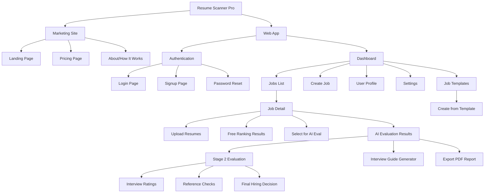
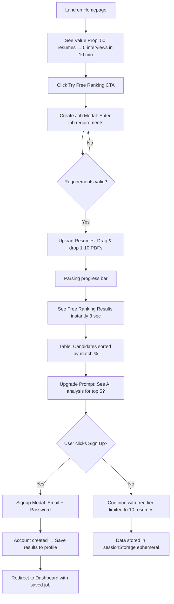
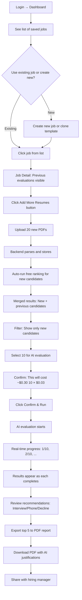
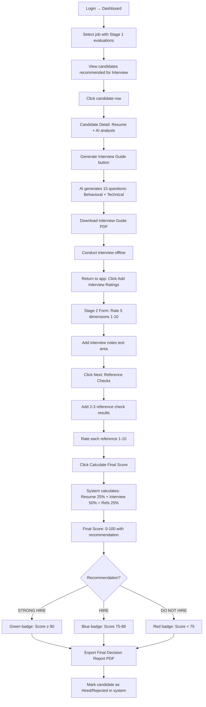
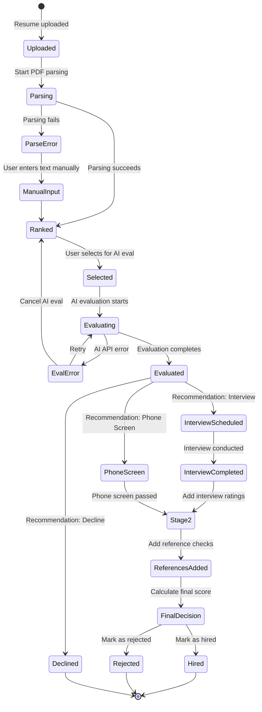
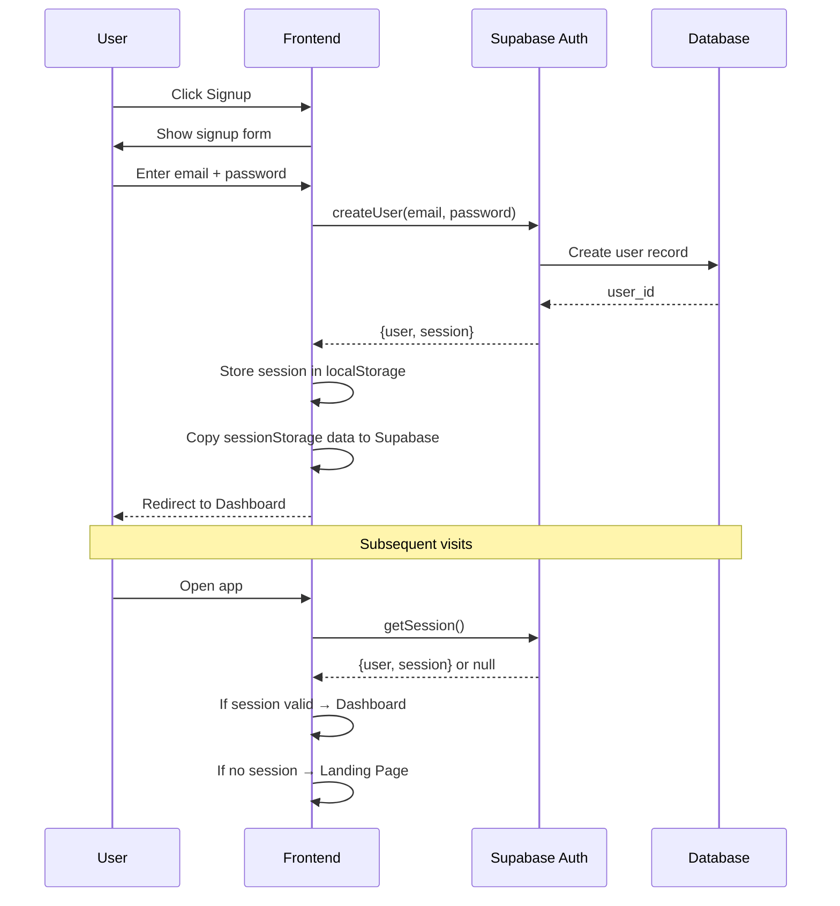
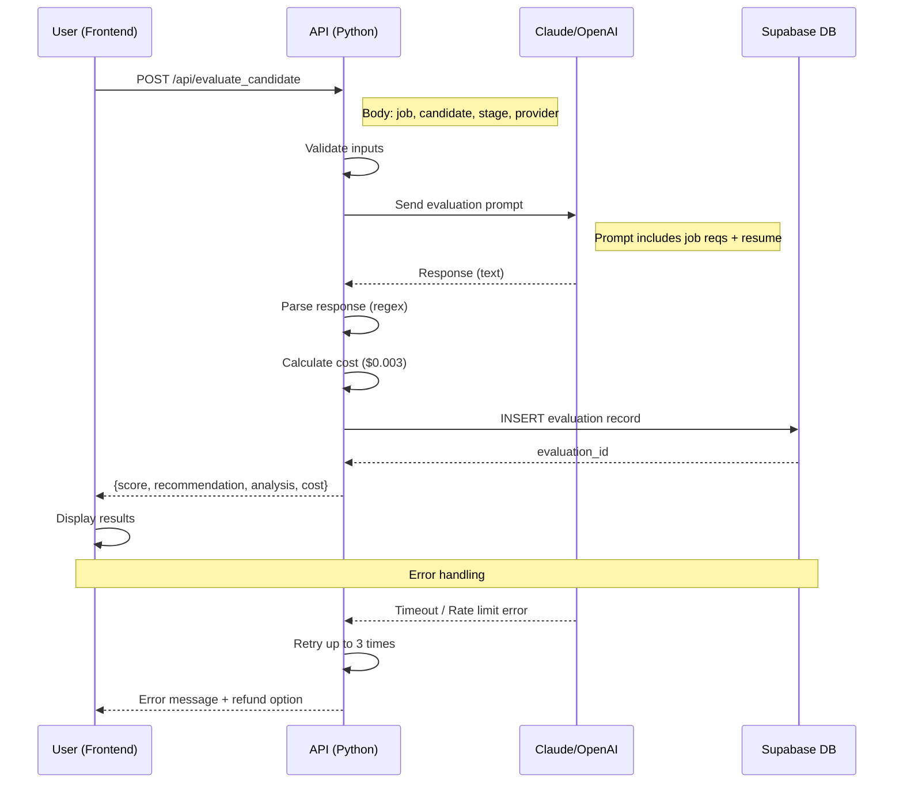

```mermaid
flowchart TD
    A[Click Signup from Landing] --> B[Signup Page: Email + Password]
    B --> C[Email verification link optional for MVP]
    C --> D[Login → Empty Dashboard]
    D --> E[Onboarding Tooltip: Create your first job]
    E --> F[Click Create Job button]
    F --> G[Job Form: Title, must-haves, preferred, description]
    G --> H{Valid job data?}
    H -->|No| G
    H -->|Yes| I[Job saved to Supabase]
    I --> J[Navigate to Job Detail page]
    J --> K[Upload Resumes: Drag & drop up to 50 files]
    K --> L[Files uploaded to Supabase Storage]
    L --> M[Backend: Parse PDFs with pdfplumber]
    M --> N[Auto-run free regex ranking]
    N --> O[Results table: Sorted by match %]
    O --> P[User selects top 5 candidates checkbox]
    P --> Q[Click Run AI Evaluation button]
    Q --> R{Has payment method?}
    R -->|No| S[Stripe payment modal: Add card]
    R -->|Yes| T[Start AI evaluation: 10 sec per candidate]
    S --> T
    T --> U[Progress bar: 1/5, 2/5, ...]
    U --> V[AI Results displayed: Scores + recommendations]
    V --> W[Success: First evaluation complete 🎉]
    W --> X[Prompt: Export PDF or Generate Interview Guide?]
```

# Resume Scanner Pro - User Flows & Wireframes

**Version:** 1.0 | **Date:** 2025-11-01 | **Type:** Visual Product Specification

---

## Table of Contents

1. [Application Sitemap](#application-sitemap)
2. [User Flow 1: Anonymous User - Try Free Feature](#user-flow-1-anonymous-user---try-free-feature)
3. [User Flow 2: New User - Signup & First Evaluation](#user-flow-2-new-user---signup--first-evaluation)
4. [User Flow 3: Returning User - Full AI Evaluation](#user-flow-3-returning-user---full-ai-evaluation)
5. [User Flow 4: Hiring Manager - Stage 2 Decision](#user-flow-4-hiring-manager---stage-2-decision)
6. [Wireframes](#wireframes)
7. [State Diagrams](#state-diagrams)

---

## Application Sitemap



---

## User Flow 1: Anonymous User - Try Free Feature

**Goal:** Convert visitors to signups by demonstrating value instantly.

**Metric:** Visitor → Free trial → Signup conversion rate (target: 30%)

### Flow Diagram



### Key Screens in This Flow
- **Landing Page** (wireframe #1)
- **Create Job Modal** (wireframe #2)
- **Upload Resumes** (wireframe #3)
- **Free Ranking Results** (wireframe #4)
- **Signup Modal** (wireframe #5)

---

## User Flow 2: New User - Signup & First Evaluation

**Goal:** Get new signups to their first AI evaluation (activation).

**Metric:** Signup → First AI eval completion within 7 days (target: 60%)

### Flow Diagram



### Key Screens in This Flow
- **Signup Page** (wireframe #5)
- **Empty Dashboard with Onboarding** (wireframe #6)
- **Create Job Form** (wireframe #7)
- **Job Detail with Upload** (wireframe #3)
- **AI Evaluation Results** (wireframe #8)

---

## User Flow 3: Returning User - Full AI Evaluation

**Goal:** Efficient repeat usage for high retention.

**Metric:** D7 retention (target: 40%)

### Flow Diagram



### Key Screens in This Flow
- **Dashboard with Jobs List** (wireframe #9)
- **Job Detail with History** (wireframe #10)
- **Add More Resumes** (wireframe #3)
- **AI Confirmation Modal** (wireframe #11)
- **Results with Export** (wireframe #8)

---

## User Flow 4: Hiring Manager - Stage 2 Decision

**Goal:** Complete full hiring lifecycle from resume → offer.

**Metric:** Stage 2 completion rate (target: 20% of Stage 1 evals)

### Flow Diagram



### Key Screens in This Flow
- **Candidate Detail** (wireframe #12)
- **Interview Guide Preview** (wireframe #13)
- **Stage 2 Evaluation Form** (wireframe #14)
- **Final Decision Screen** (wireframe #15)

---

## Wireframes

### Wireframe #1: Landing Page (Marketing)

```
┌─────────────────────────────────────────────────────────────┐
│  [Logo] Resume Scanner Pro        [Pricing] [Login] [Sign Up]│
├─────────────────────────────────────────────────────────────┤
│                                                               │
│         From 50 resumes to 5 interviews in 10 minutes        │
│                                                               │
│   AI-powered batch resume screening for busy recruiters      │
│                                                               │
│            [Try Free Ranking →]  [Watch Demo ▶]             │
│                                                               │
│  ┌─────────────┐  ┌─────────────┐  ┌─────────────┐         │
│  │ 📤 Upload    │  │ 🤖 AI Ranks  │  │ 📊 Export    │         │
│  │ 1-50 resumes │  │ in seconds   │  │ PDF report   │         │
│  └─────────────┘  └─────────────┘  └─────────────┘         │
│                                                               │
│  ✓ Free keyword ranking  ✓ Selective AI eval  ✓ Interview guides │
│                                                               │
│  "Cut resume screening time by 80%"  - Sarah M., Tech Recruiter │
│                                                               │
│  [How It Works] [Pricing] [Customer Stories]                │
└─────────────────────────────────────────────────────────────┘
```

**Key Elements:**
- Clear value proposition above the fold
- Primary CTA: "Try Free Ranking" (low friction)
- Social proof: Customer testimonial
- Benefit icons: Upload, AI, Export (visual anchors)
- Secondary CTAs: Pricing, Login, Demo

---

### Wireframe #2: Create Job Modal (Anonymous or Authenticated)

```
┌───────────────────────────────────────────┐
│  Create Job Posting                    [×]│
├───────────────────────────────────────────┤
│                                           │
│  Job Title *                              │
│  ┌───────────────────────────────────┐   │
│  │ Senior Software Engineer           │   │
│  └───────────────────────────────────┘   │
│                                           │
│  Must-Have Requirements (one per line) *  │
│  ┌───────────────────────────────────┐   │
│  │ 5+ years Python experience         │   │
│  │ React/TypeScript frontend          │   │
│  │ Postgres database                  │   │
│  │                                    │   │
│  └───────────────────────────────────┘   │
│                                           │
│  Preferred Requirements (optional)        │
│  ┌───────────────────────────────────┐   │
│  │ Supabase experience                │   │
│  │ Serverless architecture            │   │
│  │                                    │   │
│  └───────────────────────────────────┘   │
│                                           │
│  [Cancel]             [Save & Continue →] │
└───────────────────────────────────────────┘
```

**Key Elements:**
- Simple form, minimal fields for speed
- Must-have vs. preferred distinction (for scoring)
- Validation: Title + at least 1 must-have required
- Save job template option (authenticated users)

---

### Wireframe #3: Upload Resumes Page

```
┌─────────────────────────────────────────────────────────────┐
│  ← Back to Jobs         Senior Software Engineer             │
├─────────────────────────────────────────────────────────────┤
│                                                               │
│  Step 1: Upload Resumes                                      │
│                                                               │
│  ┌───────────────────────────────────────────────────────┐  │
│  │                                                         │  │
│  │          📤  Drag & drop resumes here                  │  │
│  │                                                         │  │
│  │          or [Browse Files]                             │  │
│  │                                                         │  │
│  │     Supported: PDF, DOCX  |  Max: 50 files            │  │
│  │                                                         │  │
│  └───────────────────────────────────────────────────────┘  │
│                                                               │
│  Uploaded Resumes (3 of 50)                                  │
│                                                               │
│  ✓ john_doe_resume.pdf          [×]                          │
│  ✓ jane_smith_cv.pdf            [×]                          │
│  ⏳ mike_wilson_resume.docx      Parsing... 40%               │
│                                                               │
│  [Upload More]         [Continue to Ranking →]              │
│                                                               │
└─────────────────────────────────────────────────────────────┘
```

**Key Elements:**
- Drag-and-drop area (large target)
- Progress indicators per file
- Remove file option (X button)
- Shows count: 3 of 50 uploaded
- Disabled "Continue" until at least 1 file parsed

---

### Wireframe #4: Free Ranking Results

```
┌─────────────────────────────────────────────────────────────┐
│  ← Back to Jobs         Senior Software Engineer             │
├─────────────────────────────────────────────────────────────┤
│                                                               │
│  Free Keyword Ranking (3 resumes)                            │
│  [Select candidates for AI evaluation] [Export PDF]         │
│                                                               │
│  ┌─────────────────────────────────────────────────────┐    │
│  │ [☑] | Name          | Match Score | Highlights       │ │  │
│  ├─────────────────────────────────────────────────────┤    │
│  │ ☐   | Jane Smith    | 92%    █████ | ✓ 7yr Python  │ │  │
│  │     |               |               | ✓ React exp   │ │  │
│  │     |               |               | ✓ Postgres    │ │  │
│  ├─────────────────────────────────────────────────────┤    │
│  │ ☐   | John Doe      | 78%    ████  | ✓ 5yr Python  │ │  │
│  │     |               |               | ✗ No React    │ │  │
│  │     |               |               | ✓ Postgres    │ │  │
│  ├─────────────────────────────────────────────────────┤    │
│  │ ☐   | Mike Wilson   | 65%    ███   | ✓ 4yr Python  │ │  │
│  │     |               |               | ✗ No React    │ │  │
│  │     |               |               | ✗ No Postgres │ │  │
│  └─────────────────────────────────────────────────────┘    │
│                                                               │
│  💡 Upgrade to AI evaluation for deeper analysis (2 selected)│
│  [Run AI Evaluation on Selected] $0.06                      │
│                                                               │
└─────────────────────────────────────────────────────────────┘
```

**Key Elements:**
- Sortable table (by match score, name, etc.)
- Checkbox selection for AI evaluation
- Match score visualization (progress bar)
- Highlights: ✓ (has) / ✗ (missing) for requirements
- Upgrade CTA with cost preview
- Export PDF (for free tier users)

---

### Wireframe #5: Signup Modal

```
┌───────────────────────────────────────────┐
│  Create Your Account                   [×]│
├───────────────────────────────────────────┤
│                                           │
│  Save your results and unlock AI          │
│  evaluation for top candidates.           │
│                                           │
│  Email *                                  │
│  ┌───────────────────────────────────┐   │
│  │ you@company.com                    │   │
│  └───────────────────────────────────┘   │
│                                           │
│  Password * (min 8 characters)            │
│  ┌───────────────────────────────────┐   │
│  │ ••••••••                           │   │
│  └───────────────────────────────────┘   │
│                                           │
│  [☐] I agree to Terms & Privacy Policy    │
│                                           │
│  [Create Account]                         │
│                                           │
│  Already have an account? [Login]         │
│                                           │
│  ─────────── or ───────────               │
│                                           │
│  [Continue with Google]                   │
│  [Continue with Apple]                    │
│                                           │
└───────────────────────────────────────────┘
```

**Key Elements:**
- Simple form: email + password only
- Social auth options (Google, Apple) for faster signup
- Terms acceptance checkbox (legal requirement)
- Link to login for existing users
- Value reminder: "Save results and unlock AI"

---

### Wireframe #6: Empty Dashboard (New User Onboarding)

```
┌─────────────────────────────────────────────────────────────┐
│  [Logo] Resume Scanner Pro    [Profile ▼] [Logout]          │
├─────────────────────────────────────────────────────────────┤
│                                                               │
│  Dashboard                                                    │
│                                                               │
│  ┌─────────────────────────────────────────────────────┐    │
│  │  👋 Welcome! Let's create your first job posting     │    │
│  │                                                       │    │
│  │  Click "Create Job" below to start screening resumes │    │
│  │                                                       │    │
│  │  [Create Your First Job →]                           │    │
│  └─────────────────────────────────────────────────────┘    │
│                                                               │
│  Your Jobs (0)                                                │
│                                                               │
│  ┌───────────────────────────────────────┐                   │
│  │                                       │                   │
│  │     No jobs yet. Get started above!  │                   │
│  │                                       │                   │
│  └───────────────────────────────────────┘                   │
│                                                               │
│  [+ Create Job]  [Browse Templates]                          │
│                                                               │
└─────────────────────────────────────────────────────────────┘
```

**Key Elements:**
- Friendly onboarding message
- Clear CTA: Create Your First Job
- Empty state with helpful guidance
- Template option for faster setup
- Simple navigation: Dashboard, Profile, Logout

---

### Wireframe #7: Create Job Form (Full Page)

```
┌─────────────────────────────────────────────────────────────┐
│  [Logo] Resume Scanner Pro    [Profile ▼] [Logout]          │
├─────────────────────────────────────────────────────────────┤
│                                                               │
│  ← Back to Dashboard                                         │
│                                                               │
│  Create New Job                                               │
│                                                               │
│  Job Title *                                                  │
│  ┌───────────────────────────────────────────────────────┐  │
│  │ Senior Software Engineer                               │  │
│  └───────────────────────────────────────────────────────┘  │
│                                                               │
│  Job Description (optional)                                   │
│  ┌───────────────────────────────────────────────────────┐  │
│  │ We're looking for a senior engineer to lead our       │  │
│  │ backend team and build scalable Python services...    │  │
│  │                                                        │  │
│  └───────────────────────────────────────────────────────┘  │
│                                                               │
│  Must-Have Requirements * (one per line)                      │
│  ┌───────────────────────────────────────────────────────┐  │
│  │ 5+ years Python experience                             │  │
│  │ React/TypeScript frontend                              │  │
│  │ Postgres database                                      │  │
│  │ [Add requirement]                                      │  │
│  └───────────────────────────────────────────────────────┘  │
│                                                               │
│  Preferred Requirements (nice-to-have)                        │
│  ┌───────────────────────────────────────────────────────┐  │
│  │ Supabase experience                                    │  │
│  │ Serverless architecture (Vercel/Lambda)                │  │
│  │ [Add requirement]                                      │  │
│  └───────────────────────────────────────────────────────┘  │
│                                                               │
│  [☐] Save as template for future use                         │
│                                                               │
│  [Cancel]                      [Create Job & Upload Resumes →]│
│                                                               │
└─────────────────────────────────────────────────────────────┘
```

**Key Elements:**
- Clear required vs. optional fields
- Dynamic "Add requirement" buttons
- Save as template option (for recurring roles)
- Next step preview: "Create Job & Upload Resumes"
- Cancel returns to dashboard (with unsaved changes warning)

---

### Wireframe #8: AI Evaluation Results

```
┌─────────────────────────────────────────────────────────────┐
│  ← Back to Jobs         Senior Software Engineer             │
├─────────────────────────────────────────────────────────────┤
│                                                               │
│  AI Evaluation Results (3 candidates evaluated)               │
│  [Generate Interview Guides] [Export to PDF]                 │
│                                                               │
│  ┌─────────────────────────────────────────────────────────┐│
│  │ Jane Smith                          Score: 87/100        ││
│  │ Recommendation: INTERVIEW            🟢 Strong Fit       ││
│  ├─────────────────────────────────────────────────────────┤│
│  │ ▼ AI Analysis (click to expand)                         ││
│  │   Qualifications: 38/40  Experience: 35/40  Risk: 14/20 ││
│  │                                                          ││
│  │   ✓ Strong Python background (7 years)                  ││
│  │   ✓ React expertise demonstrated in 3 projects          ││
│  │   ✓ Postgres DBA certification                          ││
│  │   ⚠ No Supabase experience (can learn)                  ││
│  │                                                          ││
│  │   [View Full Resume] [Generate Interview Guide]         ││
│  └─────────────────────────────────────────────────────────┘│
│                                                               │
│  ┌─────────────────────────────────────────────────────────┐│
│  │ John Doe                            Score: 76/100        ││
│  │ Recommendation: PHONE SCREEN         🟡 Moderate Fit    ││
│  ├─────────────────────────────────────────────────────────┤│
│  │ ▼ AI Analysis                                           ││
│  │   Qualifications: 32/40  Experience: 30/40  Risk: 14/20 ││
│  │                                                          ││
│  │   ✓ Meets Python requirement (5 years)                  ││
│  │   ⚠ Limited React experience (1 small project)          ││
│  │   ✓ Postgres experience confirmed                       ││
│  │   ✗ Career gap 2021-2022 (unexplained)                  ││
│  │                                                          ││
│  │   [View Full Resume] [Generate Interview Guide]         ││
│  └─────────────────────────────────────────────────────────┘│
│                                                               │
│  ┌─────────────────────────────────────────────────────────┐│
│  │ Mike Wilson                         Score: 64/100        ││
│  │ Recommendation: DECLINE              🔴 Weak Fit        ││
│  ├─────────────────────────────────────────────────────────┤│
│  │ ▼ AI Analysis                                           ││
│  │   Qualifications: 25/40  Experience: 28/40  Risk: 11/20 ││
│  │                                                          ││
│  │   ⚠ Only 4 years Python (below 5yr requirement)         ││
│  │   ✗ No React/frontend experience                        ││
│  │   ✗ NoSQL only (MongoDB), no Postgres                   ││
│  │                                                          ││
│  │   [View Full Resume]                                    ││
│  └─────────────────────────────────────────────────────────┘│
│                                                               │
└─────────────────────────────────────────────────────────────┘
```

**Key Elements:**
- Candidates sorted by score (highest first)
- Color-coded recommendations: 🟢 Interview, 🟡 Phone Screen, 🔴 Decline
- Collapsible AI analysis sections
- Score breakdown by category (Qualifications, Experience, Risk)
- Bullet points: ✓ (strength), ⚠ (concern), ✗ (gap)
- Actions per candidate: View resume, Generate interview guide
- Batch actions: Export all to PDF

---

### Wireframe #9: Dashboard with Jobs List

```
┌─────────────────────────────────────────────────────────────┐
│  [Logo] Resume Scanner Pro    [Profile ▼] [Logout]          │
├─────────────────────────────────────────────────────────────┤
│                                                               │
│  Dashboard                                                    │
│                                                               │
│  Your Jobs (5)            [+ Create Job] [Browse Templates]  │
│                                                               │
│  ┌─────────────────────────────────────────────────────────┐│
│  │ Senior Software Engineer              Updated: Oct 25    ││
│  │ 12 resumes evaluated | 3 interviews scheduled            ││
│  │ [Open Job →]                                             ││
│  └─────────────────────────────────────────────────────────┘│
│                                                               │
│  ┌─────────────────────────────────────────────────────────┐│
│  │ Product Manager                       Updated: Oct 20    ││
│  │ 8 resumes evaluated | 2 phone screens                   ││
│  │ [Open Job →]                                             ││
│  └─────────────────────────────────────────────────────────┘│
│                                                               │
│  ┌─────────────────────────────────────────────────────────┐│
│  │ Sales Representative                  Updated: Oct 15    ││
│  │ 25 resumes uploaded | Pending evaluation                ││
│  │ [Open Job →]                                             ││
│  └─────────────────────────────────────────────────────────┘│
│                                                               │
│  [Load More...]                                               │
│                                                               │
└─────────────────────────────────────────────────────────────┘
```

**Key Elements:**
- Job cards showing title, status, resume count
- Last updated timestamp
- Quick status: "3 interviews scheduled", "Pending evaluation"
- Create Job and Browse Templates CTAs
- Pagination for large job lists

---

### Wireframe #10: Job Detail with History

```
┌─────────────────────────────────────────────────────────────┐
│  ← Back to Dashboard    Senior Software Engineer             │
├─────────────────────────────────────────────────────────────┤
│                                                               │
│  [Edit Job] [Add More Resumes] [Export All Results]         │
│                                                               │
│  Job Requirements:                                            │
│  Must-have: Python 5yr, React, Postgres                      │
│  Preferred: Supabase, Serverless                             │
│                                                               │
│  Evaluation History                                           │
│                                                               │
│  ┌─────────────────────────────────────────────────────────┐│
│  │ Filter: [All] [Interview] [Phone Screen] [Declined]     ││
│  │ Sort by: [Score ▼] [Name] [Date Evaluated]              ││
│  └─────────────────────────────────────────────────────────┘│
│                                                               │
│  ┌─────────────────────────────────────────────────────────┐│
│  │ Jane Smith          87/100  🟢 Interview   Oct 25        ││
│  │ [View Details] [Generate Interview Guide] [Stage 2 →]   ││
│  └─────────────────────────────────────────────────────────┘│
│                                                               │
│  ┌─────────────────────────────────────────────────────────┐│
│  │ John Doe            76/100  🟡 Phone Screen  Oct 25      ││
│  │ [View Details] [Generate Interview Guide]                ││
│  └─────────────────────────────────────────────────────────┘│
│                                                               │
│  ┌─────────────────────────────────────────────────────────┐│
│  │ Mike Wilson         64/100  🔴 Decline      Oct 25       ││
│  │ [View Details]                                           ││
│  └─────────────────────────────────────────────────────────┘│
│                                                               │
│  Showing 3 of 12 results                                      │
│                                                               │
└─────────────────────────────────────────────────────────────┘
```

**Key Elements:**
- Persistent job requirements display
- Filter by recommendation (Interview, Phone, Decline)
- Sort by score, name, date
- Candidate cards with quick actions
- Stage 2 link for candidates moving to interview
- Add More Resumes for ongoing recruiting

---

### Wireframe #11: AI Confirmation Modal

```
┌───────────────────────────────────────────┐
│  Confirm AI Evaluation                 [×]│
├───────────────────────────────────────────┤
│                                           │
│  You've selected 5 candidates for AI      │
│  evaluation.                              │
│                                           │
│  ┌───────────────────────────────────┐   │
│  │ • Jane Smith                       │   │
│  │ • John Doe                         │   │
│  │ • Mike Wilson                      │   │
│  │ • Sarah Lee                        │   │
│  │ • Tom Harris                       │   │
│  └───────────────────────────────────┘   │
│                                           │
│  Cost Breakdown:                          │
│  5 candidates × $0.03 = $0.15            │
│                                           │
│  Estimated time: ~50 seconds              │
│                                           │
│  This will be charged to your card        │
│  ending in ****1234.                      │
│                                           │
│  [Cancel]              [Confirm & Run AI] │
│                                           │
└───────────────────────────────────────────┘
```

**Key Elements:**
- List of selected candidates
- Transparent cost calculation
- Time estimate (10 sec per candidate)
- Payment method confirmation
- Cancel option (no charge)
- Clear CTA: "Confirm & Run AI"

---

### Wireframe #12: Candidate Detail Page

```
┌─────────────────────────────────────────────────────────────┐
│  ← Back to Job         Jane Smith - Senior Software Engineer │
├─────────────────────────────────────────────────────────────┤
│                                                               │
│  Score: 87/100  🟢 Recommendation: INTERVIEW                 │
│                                                               │
│  [Generate Interview Guide] [Move to Stage 2] [Export PDF]  │
│                                                               │
│  ┌─────────────────────────────────────────────────────────┐│
│  │ AI Evaluation Summary                                    ││
│  │                                                          ││
│  │ Qualifications: 38/40 ████████████████                  ││
│  │ Experience:     35/40 ██████████████                    ││
│  │ Risk Flags:     14/20 ███████                           ││
│  │                                                          ││
│  │ STRENGTHS:                                               ││
│  │ ✓ 7 years Python development (Django, Flask)            ││
│  │ ✓ React/TypeScript: 4 production apps                   ││
│  │ ✓ Postgres DBA certification                            ││
│  │ ✓ Led team of 5 engineers                               ││
│  │                                                          ││
│  │ CONCERNS:                                                ││
│  │ ⚠ No Supabase experience (quick to learn)               ││
│  │ ⚠ Salary expectations may be high (staff level)         ││
│  │                                                          ││
│  │ GAPS:                                                    ││
│  │ (None identified)                                        ││
│  └─────────────────────────────────────────────────────────┘│
│                                                               │
│  ┌─────────────────────────────────────────────────────────┐│
│  │ Resume Preview                              [View Full]  ││
│  │                                                          ││
│  │ Jane Smith                                               ││
│  │ jane.smith@email.com | (555) 123-4567                    ││
│  │                                                          ││
│  │ EXPERIENCE                                               ││
│  │ Senior Software Engineer, TechCorp (2020-Present)        ││
│  │ - Led backend team building Python microservices        ││
│  │ - Migrated monolith to React SPA...                      ││
│  │                                                          ││
│  │ [Full resume text...]                                    ││
│  └─────────────────────────────────────────────────────────┘│
│                                                               │
└─────────────────────────────────────────────────────────────┘
```

**Key Elements:**
- Overall score with color-coded recommendation
- Score breakdown by category (visual progress bars)
- AI analysis in 3 sections: Strengths, Concerns, Gaps
- Resume preview (expandable)
- Actions: Interview guide, Stage 2, Export
- Full resume view option

---

### Wireframe #13: Interview Guide Preview

```
┌─────────────────────────────────────────────────────────────┐
│  ← Back to Candidate    Interview Guide: Jane Smith          │
├─────────────────────────────────────────────────────────────┤
│                                                               │
│  AI-Generated Interview Guide                                 │
│  Generated: Oct 25, 2025                                      │
│                                                               │
│  [Download PDF] [Edit Questions] [Email to Hiring Manager]   │
│                                                               │
│  ┌─────────────────────────────────────────────────────────┐│
│  │ BEHAVIORAL QUESTIONS (5)                                 ││
│  │                                                          ││
│  │ 1. Tell me about a time you led a team through a        ││
│  │    challenging technical migration. What was your        ││
│  │    approach?                                             ││
│  │    → Evaluates: Leadership, problem-solving              ││
│  │                                                          ││
│  │ 2. Describe a situation where you had to make a         ││
│  │    trade-off between technical debt and shipping fast.  ││
│  │    How did you decide?                                   ││
│  │    → Evaluates: Judgment, pragmatism                     ││
│  │                                                          ││
│  │ [Expand for questions 3-5...]                            ││
│  └─────────────────────────────────────────────────────────┘│
│                                                               │
│  ┌─────────────────────────────────────────────────────────┐│
│  │ TECHNICAL QUESTIONS (7)                                  ││
│  │                                                          ││
│  │ 1. Explain the trade-offs between Django and Flask      ││
│  │    for a new microservice. When would you choose each?  ││
│  │    → Tests: Python framework knowledge                   ││
│  │                                                          ││
│  │ 2. Walk me through how you'd optimize a slow Postgres   ││
│  │    query. What tools and techniques do you use?         ││
│  │    → Tests: Database optimization, debugging             ││
│  │                                                          ││
│  │ [Expand for questions 3-7...]                            ││
│  └─────────────────────────────────────────────────────────┘│
│                                                               │
│  ┌─────────────────────────────────────────────────────────┐│
│  │ ROLE-SPECIFIC QUESTIONS (3)                              ││
│  │                                                          ││
│  │ 1. Our tech stack uses Supabase (which you haven't      ││
│  │    used). How would you approach learning it quickly?   ││
│  │    → Tests: Learning agility, self-direction             ││
│  │                                                          ││
│  │ [Expand for questions 2-3...]                            ││
│  └─────────────────────────────────────────────────────────┘│
│                                                               │
└─────────────────────────────────────────────────────────────┘
```

**Key Elements:**
- 3 question categories: Behavioral, Technical, Role-specific
- Each question includes evaluation criteria
- Collapsible sections (show 2, expand for rest)
- Download PDF for offline use
- Edit questions before finalizing
- Email option to send to hiring manager

---

### Wireframe #14: Stage 2 Evaluation Form

```
┌─────────────────────────────────────────────────────────────┐
│  ← Back to Candidate    Stage 2 Evaluation: Jane Smith       │
├─────────────────────────────────────────────────────────────┤
│                                                               │
│  Resume Score (Stage 1): 87/100  🟢                          │
│                                                               │
│  ┌─────────────────────────────────────────────────────────┐│
│  │ Interview Ratings (50% weight)                           ││
│  │                                                          ││
│  │ Technical Skills (1-10)              [    8    ]        ││
│  │ Problem Solving (1-10)               [    9    ]        ││
│  │ Communication (1-10)                 [    8    ]        ││
│  │ Cultural Fit (1-10)                  [    9    ]        ││
│  │ Leadership Potential (1-10)          [    8    ]        ││
│  │                                                          ││
│  │ Interview Notes:                                         ││
│  │ ┌───────────────────────────────────────────────────┐   ││
│  │ │ Strong technical depth in Python. Great problem-  │   ││
│  │ │ solving during whiteboard exercise. Clear         │   ││
│  │ │ communicator. Expressed excitement about Supabase │   ││
│  │ │ and serverless architecture.                      │   ││
│  │ └───────────────────────────────────────────────────┘   ││
│  └─────────────────────────────────────────────────────────┘│
│                                                               │
│  ┌─────────────────────────────────────────────────────────┐│
│  │ Reference Checks (25% weight)                            ││
│  │                                                          ││
│  │ Reference 1: Sarah Johnson (Former Manager at TechCorp) ││
│  │ Overall Rating (1-10)                [    9    ]        ││
│  │ Notes:                                                   ││
│  │ ┌───────────────────────────────────────────────────┐   ││
│  │ │ "Jane was my top performer. Consistently delivered │   ││
│  │ │ high-quality work. Great team player."             │   ││
│  │ └───────────────────────────────────────────────────┘   ││
│  │                                                          ││
│  │ Reference 2: Mike Chen (Peer at TechCorp)               ││
│  │ Overall Rating (1-10)                [    8    ]        ││
│  │ Notes:                                                   ││
│  │ ┌───────────────────────────────────────────────────┐   ││
│  │ │ "Pleasure to work with. Strong technical skills,   │   ││
│  │ │ always willing to help teammates."                 │   ││
│  │ └───────────────────────────────────────────────────┘   ││
│  │                                                          ││
│  │ [+ Add Another Reference]                                ││
│  └─────────────────────────────────────────────────────────┘│
│                                                               │
│  [Cancel]                    [Calculate Final Decision →]    │
│                                                               │
└─────────────────────────────────────────────────────────────┘
```

**Key Elements:**
- Resume score carried forward from Stage 1
- 5 interview dimensions (1-10 scale)
- Free-text interview notes
- Multiple reference checks (2-3 typical)
- Rating per reference + notes
- Add reference option (dynamic form)
- Calculate Final Decision button (goes to Wireframe #15)

---

### Wireframe #15: Final Hiring Decision

```
┌─────────────────────────────────────────────────────────────┐
│  ← Back to Job         Final Decision: Jane Smith            │
├─────────────────────────────────────────────────────────────┤
│                                                               │
│  ┌─────────────────────────────────────────────────────────┐│
│  │                                                          ││
│  │                 Final Score: 86/100                      ││
│  │                                                          ││
│  │            Recommendation: STRONG HIRE 🟢                ││
│  │                                                          ││
│  └─────────────────────────────────────────────────────────┘│
│                                                               │
│  Score Breakdown:                                             │
│                                                               │
│  Resume (25%):      87/100 × 0.25 = 21.75                    │
│  Interview (50%):   84/100 × 0.50 = 42.00                    │
│  References (25%):  85/100 × 0.25 = 21.25                    │
│                                     ─────                     │
│  Total:                             85.00                     │
│                                                               │
│  ┌─────────────────────────────────────────────────────────┐│
│  │ Summary                                                  ││
│  │                                                          ││
│  │ Jane Smith is a STRONG HIRE based on:                   ││
│  │                                                          ││
│  │ ✓ Excellent resume match (87/100)                       ││
│  │ ✓ Strong interview performance (avg 8.4/10)             ││
│  │ ✓ Outstanding references (avg 8.5/10)                   ││
│  │                                                          ││
│  │ Key Strengths:                                           ││
│  │ • Technical depth in Python, React, Postgres            ││
│  │ • Proven leadership (led team of 5)                     ││
│  │ • Excellent problem-solver (whiteboard interview)       ││
│  │ • Strong culture fit (communication, teamwork)          ││
│  │                                                          ││
│  │ Minor Considerations:                                    ││
│  │ • No Supabase experience (trainable)                    ││
│  │ • May command higher salary (staff level)               ││
│  └─────────────────────────────────────────────────────────┘│
│                                                               │
│  [Export Decision Report PDF] [Mark as Hired] [Decline]      │
│                                                               │
└─────────────────────────────────────────────────────────────┘
```

**Key Elements:**
- Large, clear final score (86/100)
- Visual recommendation badge: STRONG HIRE (green)
- Score breakdown with weighted calculation
- Summary with strengths and considerations
- Actions: Export PDF, Mark as Hired, Decline
- Decision audit trail for compliance

---

## State Diagrams

### Candidate Evaluation State Machine



### Authentication Flow



### Evaluation API Flow



---

## Interaction Patterns

### Drag & Drop Upload

**Behavior:**
1. User drags files over upload area
2. Area highlights with blue border
3. User releases files
4. Files appear in list with upload progress
5. Backend parses each file
6. Progress bar updates per file
7. Checkmark appears when parse completes
8. Error icon if parse fails (with retry option)

**Edge Cases:**
- Max 50 files exceeded: Show error toast
- Invalid file type (.jpg, .exe): Show error, reject file
- File >10MB: Show warning, allow with caveat (slow)
- Duplicate file name: Append (1), (2) suffix

### Collapsible Sections

**Behavior:**
1. Default: All AI analyses collapsed (show only score)
2. User clicks "▼ AI Analysis" header
3. Section expands with smooth animation (200ms)
4. Arrow rotates to "▲"
5. User clicks again to collapse

**Performance:**
- Max 50 candidates visible at once
- Use virtual scrolling if >50
- Lazy load AI analysis text (fetch on expand)

### Real-Time Evaluation Progress

**Behavior:**
1. User clicks "Run AI Evaluation"
2. Modal appears: "Evaluating 1/5 candidates..."
3. Progress bar fills (20% per candidate)
4. Each result streams in as it completes
5. User can view partial results while others process
6. Cancel button aborts remaining evals (partial refund)

**Technical:**
- Use Server-Sent Events (SSE) or WebSocket for real-time updates
- Fallback: Polling every 2 seconds if SSE not supported

---

## Mobile Considerations

### Responsive Breakpoints

- **Desktop:** >1024px (full layout)
- **Tablet:** 768px-1024px (2-column → 1-column)
- **Mobile:** <768px (stacked layout, hamburger menu)

### Mobile-Specific Adjustments

**Upload:** Show "Tap to Upload" instead of drag-and-drop

**Tables:** Convert to card layout (1 card per candidate)

**Long Forms:** Break into multi-step wizard (e.g., Create Job → 3 steps)

**Modals:** Full-screen on mobile (easier to fill forms)

---

## Accessibility (A11y)

### Keyboard Navigation
- All actions accessible via Tab + Enter
- Skip links: "Skip to main content"
- Focus visible on all interactive elements

### Screen Readers
- ARIA labels for all icons ("Close modal", "Upload resumes")
- Semantic HTML: `<main>`, `<nav>`, `<section>`
- Alt text for images/icons

### Color Contrast
- WCAG AA compliance (4.5:1 text, 3:1 large text)
- Don't rely on color alone (use icons + text)
- Example: 🟢 INTERVIEW (icon + text, not just green)

---

## Performance Optimizations

### Lazy Loading
- Candidate AI analysis: Fetch on expand (not upfront)
- Pagination: Load 20 candidates at a time
- Resume previews: Load on click (not in table)

### Caching (React Query)
- Job list: Cache 5 minutes
- Evaluation results: Cache 1 hour
- User profile: Cache until mutation

### Image Optimization
- No images in MVP (text-only UI for speed)
- Future: Use WebP for logos, lazy load

---

## Next Steps

1. **Review Wireframes** - Gather feedback on layout, flow, usability
2. **User Testing** - Walk 2-3 recruiters through flows, identify friction
3. **Design Polish** - Hire designer to create high-fidelity mockups (optional for MVP)
4. **Frontend Implementation** - Build React components based on wireframes
5. **Analytics Instrumentation** - Add event tracking to all key interactions (see [ANALYTICS.md](ANALYTICS.md))

---

**Document Owner:** Product & Growth Lead
**Last Updated:** 2025-11-01
**Status:** Draft for review
