# User Flows - Resume Scanner Pro

**Version:** 3.0 FINAL | **Date:** 2025-11-02

This document contains all critical user flows as Mermaid diagrams.

---

## Flow 1: First-Time User - Job Creation to Export

---

## Flow 2: Returning User - Adding Candidates to Existing Job

---

## Flow 3: Smart Rerun Logic (Cost Optimization)

```mermaid
flowchart TD
    Start([User has evaluated 50 candidates]) --> ReviewList[Scans ranked list]
    ReviewList --> Shortlist[Marks 10 as shortlisted]

    Shortlist --> NotesDecision{Add notes?}
    NotesDecision -->|No| RerunkNoNotes[Click: Rerun Ranking]
    NotesDecision -->|Yes| AddNotes[Adds notes to 2 candidates]

    AddNotes --> NotesSaved[Notes saved to DB]
    NotesSaved --> RerunkButton[Click: Rerun with Context]

    RerunkButton --> ConfirmModal[Confirmation modal appears]
    RerunkNoNotes --> ConfirmModal

    ConfirmModal --> ShowCandidates[Shows: 10 shortlisted + 2 noted = 12 total]
    ShowCandidates --> ShowCost[Cost: 12 × $0.003 = $0.036]
    ShowCost --> ShowSavings[Savings: vs $0.15 full rerun = 76%]

    ShowSavings --> ConfirmChoice{User confirms?}
    ConfirmChoice -->|No| Cancel[Cancel - no charges]
    ConfirmChoice -->|Yes| SmartRerun[Smart rerun processes 12 candidates]

    SmartRerun --> RerunLogic{Smart rerun logic}
    RerunLogic --> GetShortlisted[Get all shortlisted: 10 candidates]
    RerunLogic --> GetNoted[Get candidates with new notes: 2 candidates]

    GetShortlisted --> Union[Union no duplicates: 12 total]
    GetNoted --> Union

    Union --> APICall[Call API: rerank_with_feedback]
    APICall --> ProcessParallel[Process 3 at a time parallel]

    ProcessParallel --> Results[Updated scores returned]
    Results --> UpdateDB[Update evaluations table]

    UpdateDB --> IncrementRun[Increment: 2/50 → 3/50 runs]
    IncrementRun --> ShowUpdated[Show updated rankings]

    ShowUpdated --> Movement[Display movement: Jane 87→92 +5]
    Movement --> End([Complete!])

    Cancel --> End
```

---

## Flow 4: Tier Limit Management (Free → Pro)

---

## Flow 5: Run Limit Hit (50/50 runs per job)

```mermaid
flowchart TD
    Start([User has used 42/50 runs]) --> JobDetail[Job detail view]
    JobDetail --> ProgressBar[Shows: 42/50 runs ████████████░░ 84%]

    ProgressBar --> Warning[⚠️ Warning: Approaching limit 8 runs left]
    Warning --> ContinueWork[User adds 5 candidates]

    ContinueWork --> Rerun1[Rerun: 43/50]
    Rerun1 --> Rerun2[Rerun: 44/50]
    Rerun2 --> More[... continues working]

    More --> Rerun49[Rerun: 49/50]
    Rerun49 --> ProgressBar2[Shows: 49/50 runs ███████████████░ 98%]

    ProgressBar2 --> FinalWarning[⚠️ ALERT: 1 run remaining!]
    FinalWarning --> LastRerun[User triggers final rerun]

    LastRerun --> Rerun50[Rerun: 50/50 LIMIT REACHED]
    Rerun50 --> LimitModal[Modal: Run limit reached]

    LimitModal --> ShowState[Current state preserved: 20 candidates, 5 shortlisted]
    ShowState --> Options{Choose option}

    Options -->|1| ExportFinal[Export current results PDF]
    Options -->|2| UpgradePro[Upgrade to Pro: Unlimited runs]
    Options -->|3| NewJob[Create new AI job if slots available]

    ExportFinal --> Share[Share with manager]
    Share --> DoneFree[Done with free tier]

    UpgradePro --> ProTier[Pro tier: Unlimited runs]
    ProTier --> ContinueSameJob[Continue this job unlimited]

    NewJob --> CheckSlots{AI job slots?}
    CheckSlots -->|Yes 2/3| CreateNew[Create new job with 50 fresh runs]
    CheckSlots -->|No 3/3| MustUpgrade[Must upgrade to Pro]

    CreateNew --> FreshStart[Start fresh with 50 runs]
    MustUpgrade --> UpgradePro

    ContinueSameJob --> End([Complete!])
    FreshStart --> End
    DoneFree --> End
```

---

## Flow 6: Shortlist Tier Suggestions (Intelligent Defaults)

```mermaid
flowchart TD
    Start([AI evaluation completes 50 candidates]) --> Calculate[System calculates scores]
    Calculate --> Rank[Ranks 1-50 by score]

    Rank --> TierLogic{Tier suggestion logic}
    TierLogic --> Strong[Strong: Scores 85-95 10 candidates]
    TierLogic --> Maybe[Maybe: Scores 70-84 12 candidates]
    TierLogic --> Pass[Pass: Scores <70 28 candidates]

    Strong --> Display[Display tier suggestions modal]
    Maybe --> Display
    Pass --> Display

    Display --> ShowStrong[✅ STRONG 10: Jane 92, John 88...]
    Display --> ShowMaybe[🟡 MAYBE 12: Mike 78, Lisa 74...]
    Display --> ShowPass[❌ PASS 28: Low scores]

    ShowStrong --> UserDecision{User action?}

    UserDecision -->|1| MoveStrong[Click: Move Strong to Shortlist]
    UserDecision -->|2| ReviewMaybe[Click: Review Maybe Tier]
    UserDecision -->|3| ReviewAll[Click: Review All Candidates]

    MoveStrong --> Mark10[Marks 10 as shortlisted]
    Mark10 --> HidePass[Auto-hides Pass tier reduces clutter]

    HidePass --> FutureRerun[Future reruns only process 10 shortlisted]
    FutureRerun --> Savings[Saves tokens: 50 → 10 = 80% reduction]

    ReviewMaybe --> CollapseOthers[Collapses Strong and Pass]
    CollapseOthers --> Show12[Shows only 12 Maybe candidates]

    Show12 --> PromoteDecision{Promote any to shortlist?}
    PromoteDecision -->|Yes| Promote3[Promotes 3 from Maybe]
    PromoteDecision -->|No| AcceptMaybe[Accept Maybe as phone screen]

    Promote3 --> TotalShortlist[Total shortlisted: 10 Strong + 3 Maybe = 13]
    AcceptMaybe --> TotalShortlist

    ReviewAll --> ManualReview[User manually reviews all 50]
    ManualReview --> CustomShortlist[Creates custom shortlist of 8]

    TotalShortlist --> Export[Export shortlist PDF]
    CustomShortlist --> Export

    Export --> End([Complete!])
```

---

## Flow 7: Two-Stage Workflow (Resume → Interview → Hire)

```mermaid
flowchart TD
    Start([Week 1: Job posted]) --> Upload[Upload 100 resumes]
    Upload --> AIEval[AI evaluates all 100 Cost: $0.30]

    AIEval --> Tiers[System suggests: 12 Strong, 18 Maybe, 70 Pass]
    Tiers --> ReviewStrong[Recruiter reviews Strong tier]

    ReviewStrong --> AddNotes[Adds notes to 3 candidates]
    AddNotes --> Rerun[Rerun: 12 Strong + 3 noted = 15]

    Rerun --> FinalShortlist[Creates shortlist of 10]
    FinalShortlist --> ExportStage1[Exports PDF to hiring manager]

    ExportStage1 --> Schedule[Schedules phone screens]
    Schedule --> Interviews[Week 2-3: Conducts 10 phone screens]

    Interviews --> ExternalPhase[OUTSIDE SYSTEM: Hiring manager interviews]
    ExternalPhase --> Week3[Week 3: Returns to tool]

    Week3 --> OpenJob[Opens same job]
    OpenJob --> See10[Sees 10 shortlisted candidates from Week 1]

    See10 --> InterviewNotes[Adds interview context as notes]
    InterviewNotes --> Note1[Jane: Excellent culture fit, strong product sense]
    InterviewNotes --> Note2[Mike: Technical skills strong, hesitant on remote]
    InterviewNotes --> Note3[Sarah: Overqualified, flight risk]

    Note1 --> Stage2Rerun[Click: Rerun with Interview Context]
    Note2 --> Stage2Rerun
    Note3 --> Stage2Rerun

    Stage2Rerun --> Process10[AI re-evaluates 10 candidates with interview data]
    Process10 --> Cost[Cost: 10 × $0.003 = $0.03]

    Cost --> UpdatedStage2[Updated ranking: Jane 92→95, Sarah 86→78]
    UpdatedStage2 --> FinalDecision[Helps decide: Jane = top choice]

    FinalDecision --> MarkFinalist[Marks Jane as finalist]
    MarkFinalist --> HiringReport[Generates hiring manager report P1]

    HiringReport --> Offer[Makes offer to Jane]
    Offer --> Hired[Marks Jane as hired]

    Hired --> Rejected[Marks other 99 as rejected]
    Rejected --> AuditTrail[Full audit trail preserved]

    AuditTrail --> End([Hiring complete!])
```

---

## Flow 8: Regex-Only to AI Conversion (Upgrade Path)

```mermaid
flowchart TD
    Start([User creates regex-only job]) --> Upload[Uploads 30 resumes]
    Upload --> RegexEval[Regex evaluation <5s]

    RegexEval --> Results[Ranked by keyword matches]
    Results --> Score[Jane: 80/100 8/10 keywords matched]

    Score --> UserThinks{User satisfied?}
    UserThinks -->|Yes| ExportRegex[Export regex results]
    UserThinks -->|No| SeePrompt[Sees prompt: Try AI analysis?]

    SeePrompt --> AIPrompt[Modal: AI can provide reasoning, context, red flags]
    AIPrompt --> Benefits[Shows benefits: Why AI > Regex]

    Benefits --> Benefit1[• Quality of experience not just keywords]
    Benefits --> Benefit2[• Culture fit signals]
    Benefits --> Benefit3[• Red flags job hopping, gaps]
    Benefits --> Benefit4[• Leadership experience context]

    Benefit1 --> ConvertDecision{Convert to AI?}
    Benefit2 --> ConvertDecision
    Benefit3 --> ConvertDecision
    Benefit4 --> ConvertDecision

    ConvertDecision -->|No| ExportRegex
    ConvertDecision -->|Yes| CheckSlots{AI jobs available?}

    CheckSlots -->|Yes 2/3| ConvertJob[Convert: Uses 1 of 3 AI jobs]
    CheckSlots -->|No 3/3| UpgradeRequired[Must upgrade to Pro]

    ConvertJob --> AIReeval[AI re-evaluates 30 candidates]
    AIReeval --> CompareView[Side-by-side: Regex vs AI scores]

    CompareView --> Jane[Jane: Regex 80 → AI 87 Reasoning: Strong experience]
    CompareView --> Mike[Mike: Regex 75 → AI 68 Red flag: 5 jobs in 3yr]

    Jane --> Insight[Aha moment: AI caught nuances!]
    Mike --> Insight

    Insight --> NowAI[Job is now AI-powered]
    NowAI --> CanRerun[Can add notes and rerun]

    UpgradeRequired --> UpgradePro[Upgrade to Pro: Unlimited AI jobs]
    UpgradePro --> ConvertUnlimited[Convert with unlimited AI]

    ConvertUnlimited --> NowAI
    CanRerun --> End([Complete!])
    ExportRegex --> End
```

---

## Flow 9: Collaborative Feedback Loop (Inline Notes → Rerun)

```mermaid
flowchart TD
    Start([AI evaluation complete: 20 candidates]) --> ViewList[User views ranked list]
    ViewList --> Scan[Scans list 2 minutes]

    Scan --> Pattern1{Spots patterns?}
    Pattern1 -->|Top 3 good| Agree[Agrees with AI]
    Pattern1 -->|#7 outlier| Disagree[Spots issue: This person worked here before]

    Agree --> Export[Export top 3]
    Disagree --> ClickNote[Clicks inline notes field]

    ClickNote --> NotesField[Text field expands inline no modal]
    NotesField --> TypeNote[Types: Had performance issues when worked here 2019]

    TypeNote --> SaveNote[Click: Save Note]
    SaveNote --> NoteSaved[Note saved to candidate_rankings table]

    NoteSaved --> Badge[Note badge appears on candidate card]
    Badge --> ReviewMore[Continues scanning list]

    ReviewMore --> SpotAnother[Spots another: #12 has niche skill]
    SpotAnother --> AddNote2[Adds note: Startup experience undervalued]

    AddNote2 --> TwoNotes[Total: 2 notes added]
    TwoNotes --> RerunkButton[Rerun button now active]

    RerunkButton --> ShowLabel[Button shows: Rerun with Your Context 2 notes]
    ShowLabel --> ClickRerun[User clicks Rerun]

    ClickRerun --> ConfirmModal[Confirmation modal appears]
    ConfirmModal --> ShowCandidates[Shows: 5 shortlisted + 2 noted = 7 total]

    ShowCandidates --> ShowCost[Cost: 7 × $0.003 = $0.021]
    ShowCost --> ShowTime[Processing time: ~10-15 seconds]

    ShowTime --> Confirm{User confirms?}
    Confirm -->|No| Cancel[Cancel]
    Confirm -->|Yes| SmartRerun[Smart rerun: 7 candidates only]

    SmartRerun --> ProcessNotes[AI reads recruiter notes]
    ProcessNotes --> Reeval[AI re-evaluates with recruiter context]

    Reeval --> Updated[Updated scores: #7: 78→65, #12: 68→76]
    Updated --> Modal[Results modal appears]

    Modal --> ShowMovement[Jane: 87→92 +5 Your note: Culture fit]
    Modal --> ShowReasoning[AI explains: Adjusted based on startup context you provided]

    ShowMovement --> AhaMoment[Aha moment: My input made AI better!]
    ShowReasoning --> AhaMoment

    AhaMoment --> ViewUpdated[View updated rankings]
    ViewUpdated --> ExportWithNotes[Export PDF includes notes]

    ExportWithNotes --> End([Complete!])
    Export --> End
    Cancel --> End
```

---

## Flow 10: Error Handling & Recovery

---

**Next Document:** [Wireframes](WIREFRAMES.md) (Lo-fi text-based UI mocks)

**Author:** Product & Growth Lead
**Date:** 2025-11-02
